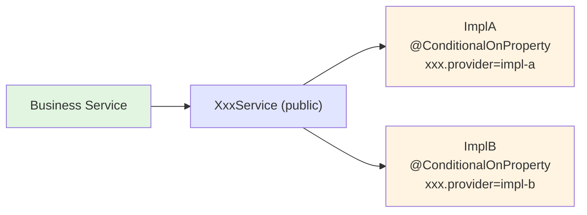

# New Backend Tech-Starter

You are helping create a new backend tech-starter in this monorepo. Tech-starters are reusable technical building blocks that abstract infrastructure concerns away from business code. They live under `tech-starters/backend/` and follow strict conventions derived from existing starters.

## Step 1 — Understand the scope

Ask the user:
1. **Name**: What is the tech-starter name? (kebab-case, suffixed with `-starter`)
2. **Technical domain**: What infrastructure problem does it solve?
3. **Public API shape**: What will consumers inject/use?
4. **Multiple implementations?**: Does it need more than one implementation? If so, which ones?
5. **Own DB tables?**: Does it need its own PostgreSQL tables?
6. **Test tooling needed?**: Does it need a JUnit Extension + Testcontainers for integration testing?

Do not proceed until you have clear answers to all six points.

---

## Step 2 — Confirm the Gradle convention to apply

Based on the answers, determine which Gradle conventions to use in `build.gradle.kts`:

| Need | Convention to add |
|---|---|
| Spring `@Service`/`@Configuration` beans | `com.drinkit.library-convention` (includes spring-context, spring-tx, event-sourcing, kotlin-starter) |
| No Spring beans, only utilities/annotations | `com.drinkit.common-convention` |
| Own PostgreSQL tables (JOOQ) | `+ com.drinkit.jooq-codegen-convention` |
| testFixtures (spy, in-memory, JUnit extensions) | `+ com.drinkit.test-fixtures-convention` |

The module directory is: `tech-starters/backend/<starter-name>/`

Gradle auto-discovers it — no manual registration in `settings.gradle.kts` is needed.

---

## Step 3 — Design the public API surface

The public API is everything a consumer module will import. Keep it minimal, stable, and free of implementation details. **Never leak internal classes.**

Rules:
- Annotate every public-facing type/function with `@TechStarterTool` from `documentation-starter`
- Interfaces should be `fun interface` when they have a single method
- Return sealed interfaces for operations that can fail or have multiple outcomes (see `OCRResponse`)
- Add Kotlin `inline`/`reified` extension functions when the API uses generics that consumers would otherwise have to pass `KClass` for (see `Configurations`)
- Domain-facing types (e.g. `Email`, `PlatformEvent`) belong in the public API package, not inside `infra/`
- Keep the public package flat: `com.drinkit.<technical-domain>.*`

Example shapes from existing starters:

```kotlin
// Single-method service abstraction (mail-starter)
@TechStarterTool
fun interface EmailSender {
    fun send(email: Email)
}

// Richer service abstraction (ocr-starter)
@TechStarterTool
interface OCRAnalysis {
    fun featureAvailable(): Boolean
    fun extractText(resource: Resource, locale: Locale): OCRResponse
}

// Typed data abstraction (messaging-starter)
@TechStarterTool
interface PlatformEventPublisher {
    fun <EventType : PlatformEvent<EventType>> publish(event: EventType): EventType
}
```

---

## Step 4 — Design the internal implementation(s)

All implementation classes must be `internal`. They are Spring beans unknown to consumers.

### Single implementation
```kotlin
// internal, Spring manages it, consumer never sees it
@Service
internal class RealXxxService(private val dependency: Dependency) : XxxService {
    // ...
}

@Configuration
internal class XxxConfig {
    @Bean
    fun xxxDependency(...): Dependency = ...
}
```

### Multiple implementations (selection via config property)
Use `@ConditionalOnProperty` to select the active implementation. Document the property name clearly:

```kotlin
@Service
@ConditionalOnProperty(name = ["xxx.provider"], havingValue = "impl-a")
internal class ImplAService : XxxService { ... }

@Service
@ConditionalOnProperty(name = ["xxx.provider"], havingValue = "impl-b")
internal class ImplBService : XxxService { ... }
```

For dev/fallback implementations, combine with `@Profile("dev")`:
```kotlin
@Service
@Profile("dev")
@ConditionalOnProperty(name = ["xxx.enabled"], havingValue = "false")
internal class NoOpXxxService : XxxService { ... }
```

For multiple pluggable implementations driven by environment (like OCR analyzers), use an internal enum + factory:
```kotlin
internal enum class XxxAvailableProvider(
    val computeStatus: (Environment) -> ProviderStatus,
) {
    PROVIDER_A(computeStatus = { env -> ... }),
    PROVIDER_B(computeStatus = { env -> ... }),
}
```

### JOOQ-backed implementation
When the starter has its own table, place the JOOQ implementation in an `infra/` subpackage:
```kotlin
@Service
internal class JooqXxxRepository(private val dsl: DSLContext) : XxxRepository { ... }
```

Configure jooq codegen in `build.gradle.kts`:
```kotlin
jooq {
    executions.getByName("main") {
        configuration.apply {
            generator.apply {
                database.apply {
                    includes = "your_table_name"
                    inputSchema = "drinkit_application"
                }
                target.apply {
                    packageName = "com.drinkit.<technical-domain>.generated.jooq"
                }
            }
        }
    }
}
```

---

## Step 5 — Create testFixtures

testFixtures are used by **consumers** of the starter in their own tests. They must not use Testcontainers or I/O themselves (that's what JUnit Extensions are for).

### Always provide: Spy implementation
A Spy captures calls and allows assertion in domain tests. It has no Spring dependency.

```kotlin
// src/testFixtures/kotlin/com/drinkit/<domain>/SpyXxxService.kt
class SpyXxxService : XxxService {
    private val calls = mutableListOf<InputType>()

    override fun doSomething(input: InputType): OutputType {
        calls += input
        return defaultResult
    }

    fun count(): Int = calls.size
    fun findLastCall(): InputType? = calls.lastOrNull()
    fun wasCalledWith(input: InputType): Boolean = calls.contains(input)
}
```

### When the starter has state: InMemory implementation
An in-memory implementation lets domain tests stay fast and dependency-free.

```kotlin
class InMemoryXxxRepository : XxxRepository {
    private val store = mutableMapOf<Id, Entity>()

    override fun save(entity: Entity): Entity { store[entity.id] = entity; return entity }
    override fun findById(id: Id): Entity? = store[id]
    override fun delete(id: Id) { store.remove(id) }
}
```

### When integration testing is needed: JUnit Extension + annotation
Provide a JUnit 5 Extension that starts a Testcontainer and injects the client. Wrap it in a meta-annotation for ergonomics:

```kotlin
// src/testFixtures/kotlin/com/drinkit/<domain>/XxxExtension.kt
class XxxExtension : BeforeAllCallback, AfterAllCallback, ParameterResolver {

    private lateinit var client: XxxClient

    private val container = XxxContainer(IMAGE_NAME).withReuse(true)

    override fun beforeAll(context: ExtensionContext) {
        TestcontainersConfiguration.getInstance().updateUserConfig("testcontainers.reuse.enable", "true")
        if (!container.isRunning) Startables.deepStart(container).join()
        client = createClient(container)
    }

    override fun afterAll(context: ExtensionContext) { /* cleanup indexes/data */ }

    override fun supportsParameter(parameterContext: ParameterContext, extensionContext: ExtensionContext): Boolean =
        parameterContext.parameter.type == XxxClient::class.java

    override fun resolveParameter(parameterContext: ParameterContext, extensionContext: ExtensionContext): Any = client
}

// src/testFixtures/kotlin/com/drinkit/<domain>/XxxIntegrationTest.kt
@ExtendWith(XxxExtension::class)
annotation class XxxIntegrationTest
```

For PostgreSQL-backed starters, use `JooqPostgresExtension` from `postgresql-starter` testFixtures — do not rewrite it.

---

## Step 6 — Internal tests (inside the starter itself)

Place tests for the internal implementations under `src/test/kotlin/`. Use the same test contract pattern when multiple implementations exist:

```kotlin
// src/test/kotlin/.../XxxTestContract.kt
internal abstract class XxxTestContract {
    protected abstract fun createSubject(): XxxService

    @Test
    fun `description of a behaviour`() {
        val subject = createSubject()
        // ...
    }
}

// src/test/kotlin/.../InMemoryXxxTest.kt
internal class InMemoryXxxTest : XxxTestContract() {
    override fun createSubject() = InMemoryXxxService()
}

// src/test/kotlin/.../JooqXxxTest.kt
@JooqIntegrationTest(schemas = [DrinkitApplication::class])
internal class JooqXxxTest : XxxTestContract() {
    override fun createSubject() = JooqXxxService(dslContext) // injected by extension
}
```

---

## Step 7 — File and package structure to create

```
tech-starters/backend/<starter-name>/
├── build.gradle.kts
├── README.md                                    ← documentation source for Vitepress
└── src/
    ├── main/kotlin/com/drinkit/<technical-domain>/
    │   ├── XxxService.kt                        ← public API (@TechStarterTool)
    │   ├── XxxDomainTypes.kt                    ← public domain types used in the API
    │   └── infra/
    │       ├── XxxConfig.kt                     ← internal @Configuration
    │       ├── RealXxxService.kt                ← internal @Service implementation(s)
    │       └── (JooqXxxRepository.kt)           ← if JOOQ-backed
    ├── test/kotlin/com/drinkit/<technical-domain>/
    │   ├── XxxTestContract.kt                   ← abstract test contract (optional)
    │   └── InMemoryXxxTest.kt / JooqXxxTest.kt
    └── testFixtures/kotlin/com/drinkit/<technical-domain>/
        ├── SpyXxxService.kt                     ← always
        ├── (InMemoryXxxRepository.kt)           ← if stateful
        ├── (XxxExtension.kt)                    ← if Testcontainer needed
        └── (XxxIntegrationTest.kt)              ← annotation wrapping the extension
```

---

## Step 8 — Write the README.md

The `README.md` at the root of the starter module is the **authoritative documentation source**. The CI/CD pipeline picks it up and exposes it verbatim in the Vitepress site under `Engineering > Resources > Tech Starters`, then appends an auto-generated API reference section below it. Mermaid diagrams render natively via `vitepress-plugin-mermaid`.

**Write the README as if addressing a developer who will consume the starter from a business module — not someone maintaining the starter itself.**

### README structure to follow

```markdown
# <StarterName> Starter

<One sentence: what this starter provides and why it exists.>

## What is <Technical Concept>?

<2–4 sentences explaining the underlying technology or pattern, written for someone who may not know it.>

**Use Cases:**
- <concrete use case>
- <concrete use case>

## Architecture Overview

<One sentence framing the starter's design philosophy — e.g. "separates business code from X concerns".>

### <Main flow name> (e.g. "Request Flow", "Event Flow", "Write Flow")

\`\`\`mermaid
sequenceDiagram
    participant Consumer as Business Service
    participant StarterAPI as XxxService (starter)
    participant Impl as Internal Implementation
    ...
\`\`\`

### <Second flow or component view>

\`\`\`mermaid
graph TD / graph LR
    ...
\`\`\`

<Numbered explanation of the diagram: 1. ... 2. ... 3. ...>

## Key Features

### ✅ <Feature 1 — the most important consumer benefit>
<1–3 sentences + code snippet from consumer perspective>

### ✅ <Feature 2>
...

## Usage

### 1. Add Dependency

\`\`\`kotlin
dependencies {
    implementation(project(":<starter-name>"))
}
\`\`\`

### 2. Configure (if properties are needed)

\`\`\`yaml
<property-key>: <value>   # explanation
\`\`\`

### 3. Use from business code

\`\`\`kotlin
@Service
class MyBusinessService(private val xxxService: XxxService) {
    fun doBusinessThing(...) {
        xxxService.doSomething(...)
    }
}
\`\`\`

### 4. Use in tests (testFixtures)

\`\`\`kotlin
class MyBusinessServiceTest {
    private val xxxService = SpyXxxService()  // or InMemoryXxxRepository()
    private val service = MyBusinessService(xxxService)

    @Test
    fun `...`() {
        service.doBusinessThing(...)
        xxxService.count() shouldBe 1
    }
}
\`\`\`

<If a JUnit Extension is provided for integration tests, add a subsection:>

### 5. Integration testing with real infrastructure

\`\`\`kotlin
@XxxIntegrationTest
class MyIntegrationTest {
    @Test
    fun `...`(client: XxxClient) { ... }
}
\`\`\`
```

### Diagram guidelines

Use **`sequenceDiagram`** to show:
- The main interaction flow between the consumer, the starter's public API, and its internal implementation
- A second sequence for error/alternative paths if they are non-obvious

Use **`graph TD`** or **`graph LR`** to show:
- Component responsibility boundaries (what is in the starter vs what the consumer owns)
- Multiple implementations and their selection mechanism, e.g.:



Use **node styling** (`style NodeId fill:#color`) to visually separate layers:
- `#e1f5e1` (green) — consumer / business code
- `#e1e5ff` (blue) — starter public API
- `#fff3e1` (orange) — internal implementations / infrastructure
- `#ffe1e1` (red) — external systems (message brokers, third-party services)

### What NOT to put in the README

- Internal class names (`internal class RealXxxService`) — consumers never see them
- Implementation details of how Spring wires things together
- Maintenance instructions (how to add a new implementation, how to run tests)
- Anything already visible in the auto-generated API Reference appended by CI

---

## Step 9 — Checklist before finishing

Before reporting the starter as done, verify:

- [ ] All public types are annotated with `@TechStarterTool`
- [ ] All implementation classes are `internal`
- [ ] The `@Configuration` class is `internal`
- [ ] The module has no dependency on `drinkit-domain` or `drinkit-infra` (starters are agnostic of business domain)
- [ ] Property keys for conditional beans are documented with a comment or Javadoc
- [ ] testFixtures contain at least a Spy (if the public API has side effects) or an InMemory (if the public API has state)
- [ ] If the starter has a JOOQ integration test, it uses `@JooqIntegrationTest` from `postgresql-starter`, not a custom setup
- [ ] `build.gradle.kts` uses `testFixturesApi` (not `testFixturesImplementation`) for dependencies that consumers of testFixtures will need transitively
- [ ] `README.md` exists, uses the correct section structure, and all Mermaid diagrams use actual class/interface names from the implementation
- [ ] README "Usage" section covers: Gradle dependency, configuration properties (if any), consumer business code, testFixtures in unit tests, and integration test annotation (if provided)
- [ ] The module compiles: `./gradlew :<starter-name>:build`

---

## Key conventions recap

| Concept | Rule |
|---|---|
| Public API visibility | `public` (default in Kotlin) + `@TechStarterTool` |
| Implementation visibility | `internal` — never expose Spring beans |
| Spring config class | `internal @Configuration` in `infra/` subpackage |
| impl selection | `@ConditionalOnProperty` on each impl, one property key |
| testFixtures | Spy for side-effects, InMemory for state, Extension for I/O tooling |
| JOOQ codegen | Only when `jooqCodegen` task is explicitly run — not on every build |
| Module isolation | No dependency on business modules (`drinkit-domain`, `drinkit-infra`, `drinkit-backend`) |
