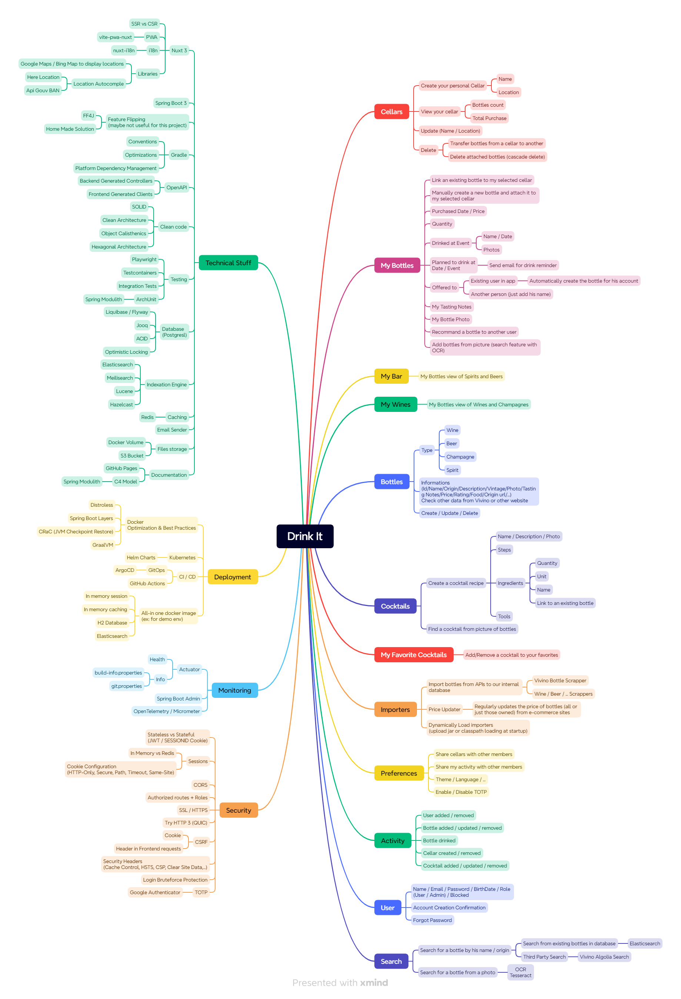

# DrinkIt
[](https://app.fossa.com/projects/git%2Bgithub.com%2Fmboisnard%2Fdrinkit?ref=badge_shield)


## Technologies

* Java 21
* Node 20.11.0
* Gradle
* Spring Boot 3.2.1 + Kotlin
* Nuxt 3 + Vue3 + PrimeVue Components Library
* OpenApi to generate frontend files and Backend Apis

## How to run the app

### Backend
```
./gradlew :drinkit-backend:build
./gradlew :drinkit-backend:bootRun #To start Spring Boot Application 
```

* Api available on: `http://localhost:8080/drinkit/api/cellars`
* OpenApi Documentation available on: `http://localhost:8080/swagger-ui/index.html`
* Actuator Endpoints available on: `http://localhost:8080/actuator`

### Frontend

**Requirements**
You need to have the java executable in your path (openapi generator javascript client downloads the Java OpenApi client to execute the task :/)


```
cd drinkit-frontend
npm i
npm run generate:client-api
npm run dev
```

* Frontend application available on: `http://localhost:3000/cellars`

## Global view of this project



## Wine & Spirit Application Examples

* https://www.akiani.fr/realisations/application-de-gestion-de-caves-a-vins-et-spiritueux/
* Vivino
* Wine Searcher
* Ploc

## Api for wine/spirits scrapper

* https://github.com/DrinkDistiller/api-docs/wiki/Spirits
* https://www.openwinedata.fr/catalog
* https://rapidapi.com/blog/best-beer-wine-alcohol-api/
* https://rapidapi.com/thecocktaildb/api/the-cocktail-db
* https://github.com/gugarosa/viviner

## Wine Bottle Size

https://en.wikipedia.org/wiki/Wine_bottle#Sizes

* Flacon - 0.1L
* Piccolo - 0.2L
* Chopine - 0.25L
* Demi-bouteille - 0.375L
* Pot - 0.5L
* Clavelin - 0.62L
* Bouteille - 0.75L
* Magnum - 1.5L
* Marie-Jeanne - 2.25L
* Double Magnum - 3.0L
* Réhoboam - 4.5L
* Jéroboam - 5.25L
* Impériale - 6.0L
* Salmanazar - 9.0L
* Balthazar - 12.0L
* Nabuchodonosor - 15.0L
* Melchior - 18.0L

## Gradle Plugins to check/add

* https://github.com/gradle/github-dependency-graph-gradle-plugin
* https://github.com/allure-framework/allure-gradle
* https://github.com/remal-gradle-plugins/idea-settings

## License
[](https://app.fossa.com/projects/git%2Bgithub.com%2Fmboisnard%2Fdrinkit?ref=badge_large)