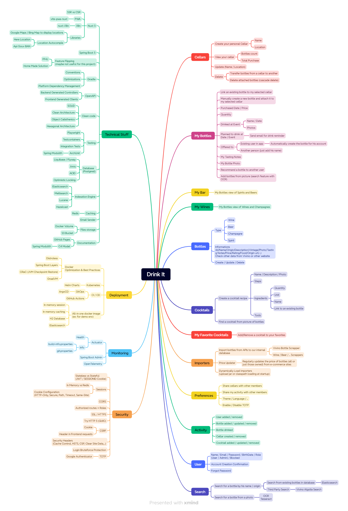

# DrinkIt

## Technologies

* Java 23
* Node 20.11.0
* Gradle
* Spring Boot 3.2.1 + Kotlin
* Nuxt 3 + Vue3 + PrimeVue Components Library
* OpenApi to generate frontend files and Backend Apis

## How to run the app

### Backend
```
./gradlew :drinkit-backend:build
./gradlew :drinkit-backend:bootRun #To start Spring Boot Application 
```

* Api available on: `http://localhost:8080/drinkit/api/cellars`
* OpenApi Documentation available on: `http://localhost:8080/swagger-ui/index.html`
* Actuator Endpoints available on: `http://localhost:8080/actuator`

### Code analysis

detekt owns both halves of static analysis: code smells through its own rule sets, and formatting
through its ktlint ruleset. A single file configures it: `code-analysis/detekt/detekt.yml`, which
holds only this project's deviations from detekt's defaults.

```
./gradlew detektAll                              #Analyse
./gradlew detektAll -Pdetekt.autoCorrect=true    #Analyse and fix what can be fixed, formatting included
./gradlew detektReportMergeSarif                 #Merge the per-module SARIF reports into one
```

`detektAll` runs every enabled detekt task of a project, and `check` runs them too. On a module
those are `detektMain`, `detektTest` and `detektTestFixtures`, the three that resolve types; on the
root project it is a pass over every `*.gradle.kts`, which belongs to no source set and would
otherwise never be checked. The CI uses the same command. The plain `detekt` task and the per-source-set ones are
disabled: they analyse without a compiled classpath, so every rule needing type information
silently never fires.

Fixing is opt-in, and driven by that project property rather than detekt's own `--auto-correct`
flag: the flag is a per-task Gradle option, so on a command line naming several tasks it binds only
to the one it follows and leaves the rest silently in report-only mode. The `autoCorrect: true`
entries in `detekt.yml` only declare which rules are *allowed* to rewrite code; without the
property detekt reports and touches nothing, which is what CI needs.

detekt is in **adoption mode** — it reports but does not fail the build, so that the current
findings stay visible in the GitHub code scanning tab instead of being buried. Drop
`ignoreFailures` from the convention once the backlog is burnt down.

To have the formatting applied automatically before each commit, enable the repository's hook once:

```
git config core.hooksPath .githooks
```

The build needs JDK 25, and `gradle/gradle-daemon-jvm.properties` is what makes that work outside
IntelliJ: Gradle picks a matching JDK for its daemon whatever JVM launched the wrapper, so the
terminal, the hook and CI no longer depend on the shell's `java`. Without it only IntelliJ knew,
through its own `gradleJvm` setting, and the hook failed on a machine whose default is older.

It reformats the staged Kotlin files and re-stages them, and refuses to run on a file that is only
partially staged rather than sweeping unstaged work into the commit. `git commit --no-verify`
skips it.

On the first Gradle sync, IntelliJ offers to install the detekt plugin, pointed at the project's
own config by `.idea/detekt.xml`, so the editor reports what the build reports. It annotates as you
type and offers `Refactor -> AutoCorrect by detekt rules`, but it does not format on save — which
is why `.editorconfig` is still there, to keep IntelliJ's own formatter aligned.

The reformatting commit is listed in `.git-blame-ignore-revs`; run
`git config blame.ignoreRevsFile .git-blame-ignore-revs` once to keep `git blame` readable.

### Frontend

**Requirements**
You need to have the java executable in your path (openapi generator javascript client downloads the Java OpenApi client to execute the task :/)


```
cd drinkit-frontend
npm i
npm run generate:client-api
npm run dev
```

* Frontend application available on: `http://localhost:3000/cellars`

## Global view of this project



## Wine & Spirit Application Examples

* https://www.akiani.fr/realisations/application-de-gestion-de-caves-a-vins-et-spiritueux/
* Vivino
* Wine Searcher
* Ploc

## Api for wine/spirits scrapper

* https://github.com/DrinkDistiller/api-docs/wiki/Spirits
* https://www.openwinedata.fr/catalog
* https://rapidapi.com/blog/best-beer-wine-alcohol-api/
* https://rapidapi.com/thecocktaildb/api/the-cocktail-db
* https://github.com/gugarosa/viviner

## Gradle Plugins to check/add

* https://github.com/gradle/github-dependency-graph-gradle-plugin
* https://github.com/allure-framework/allure-gradle
* https://github.com/remal-gradle-plugins/idea-settings

Explore
jlink / jdeps