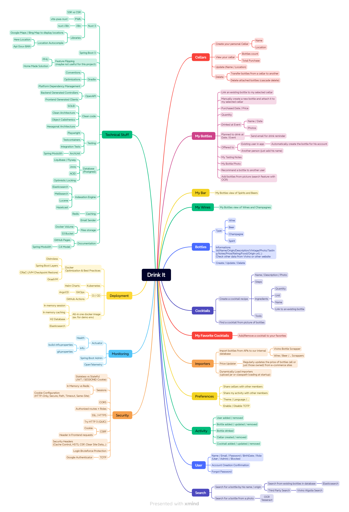

# DrinkIt

DrinkIt manages wine and spirit cellars. It is also a sandbox for engineering practices: reusable backend
tech starters, Gradle conventions, living documentation, and a harness that lets coding agents work on it
safely.

## What's inside

- `drinkit/`: the application, a Kotlin and Spring Boot backend built along a hexagonal architecture, and a
  Nuxt frontend.
- `tech-starters/backend/`: technical libraries, one concern each, with no business code.
- `build-logic/`: the Gradle convention plugins the modules apply.
- The [documentation site](https://mboisnard.github.io/drinkit/): architecture, guidelines, the pages
  generated from the code, and the [harness](docs/src/engineering/harness.md) that guards master.

## Quick start

[CONTRIBUTING.md](CONTRIBUTING.md#setup) lists what it needs. The backend starts its own containers, but on
the first run the database has no schema yet: run the updater once, as the same section explains.

```
./gradlew :drinkit-backend:bootRun     # starts deployment/local/compose.yml, then the API
```

- API: `http://localhost:8080/drinkit/api/cellars`
- OpenAPI documentation: `http://localhost:8080/drinkit/openapi/ui` (admin role)
- Actuator: `http://localhost:8080/drinkit/actuator` (admin role)

The frontend needs `java` on the `PATH` to generate its API client:

```
cd drinkit/drinkit-frontend
npm ci
npm run generate:client-api
npm run dev                            # http://localhost:3000
```

## Contributing

[CONTRIBUTING.md](CONTRIBUTING.md) explains how to write issues and pull requests. [AGENTS.md](AGENTS.md)
holds the commands, the structure and the code conventions, for people and coding agents alike.

## Global view of this project



## Wine & Spirit Application Examples

* https://www.akiani.fr/realisations/application-de-gestion-de-caves-a-vins-et-spiritueux/
* Vivino
* Wine Searcher
* Ploc

## Api for wine/spirits scrapper

* https://github.com/DrinkDistiller/api-docs/wiki/Spirits
* https://www.openwinedata.fr/catalog
* https://rapidapi.com/blog/best-beer-wine-alcohol-api/
* https://rapidapi.com/thecocktaildb/api/the-cocktail-db
* https://github.com/gugarosa/viviner

## Gradle Plugins to check/add

* https://github.com/gradle/github-dependency-graph-gradle-plugin
* https://github.com/allure-framework/allure-gradle
* https://github.com/remal-gradle-plugins/idea-settings

Explore
jlink / jdeps

