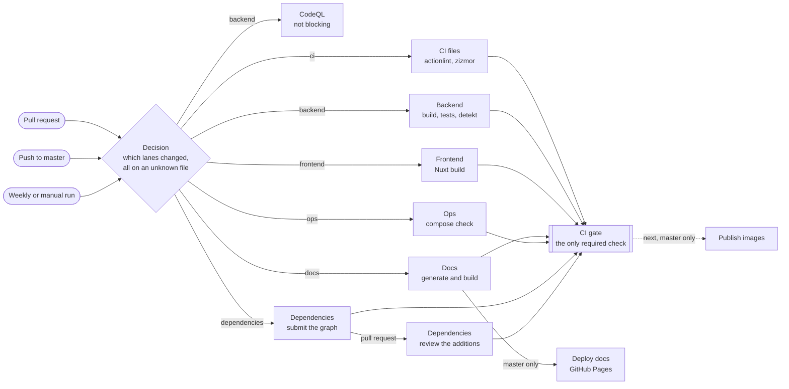

# CI/CD

Every pull request and every push to master runs one workflow, [`ci.yml`][ci-yml]. It runs only the jobs the change can affect, and one job, `CI gate`, tells the master ruleset whether the change can be merged.

## Files

`ci.yml` reads like a table of contents: the triggers, the decision, one short job per lane and the gate. Each lane lives in a file of its own, which `ci.yml` calls the way an OpenAPI document references its parts.

| File | Role | Called |
|---|---|---|
| [`ci.yml`][ci-yml] | Entry point: triggers, decision, lanes, gate | on pull requests, master pushes, by hand |
| [`config/ci-lanes.yml`][ci-lanes] | The paths of each lane, in a subfolder since GitHub reads every file at the top as a workflow | by the decision job |
| `ci-ci.yml`, `ci-backend.yml`, `ci-frontend.yml`, `ci-ops.yml`, `ci-docs.yml`, `ci-dependencies.yml` | One lane each: what it checks | by `ci.yml`, when the lane changed |
| `ci-codeql.yml` | The security analysis, outside the gate | by `ci.yml`, with the backend lane |
| `cd-docs.yml` | A deployment: publishes what a lane built | by `ci.yml`, on master |
| [`weekly.yml`][weekly-yml] | Starts a full run of `ci.yml` every Monday | on a schedule |
| [`setup-gradle-jdk`][setup-action] | The JDK and Gradle setup every Gradle job shares | by the Gradle jobs |

A job in `ci.yml` grants its lane a ceiling of permissions, and each job of the lane's file takes only what it needs within it.

## Which change runs what

`Decision` maps every changed file to the lists of `ci-lanes.yml` with [`dorny/paths-filter`][paths-filter], and gives the lanes to run as one JSON list. A lane job runs only when its lane is in it. A skipped job reports success, so a pull request that needs no lane stays mergeable.

| Change | Lanes | Why |
|---|---|---|
| `.github/**` | every lane, CI files included | Every list includes the `ci` list: a change to the CI proves every lane still runs, and actionlint and zizmor check it. The Renovate configuration and the ruleset run every lane too, rather than a rule of their own |
| The sources of a backend module or tech starter, build logic, Gradle setup and lock files, detekt configuration, `deployment/updater` | Backend, CodeQL, Docs | The domain and tech starter pages are generated from the backend sources, so the docs lane lists the backend paths too |
| `drinkit/drinkit-api-contract/contract/**` | Backend, CodeQL, Frontend, Docs | The Kotlin delegates and the TypeScript client are both generated from it |
| `drinkit/drinkit-frontend/**` | Frontend | |
| `docs/**`, or a tech starter `README.md` | Docs | A starter README is copied into its page |
| `.nvmrc` | Frontend, Docs | The Node version both use |
| A Gradle script or lock file, anything under `gradle/`, a `package.json` or `package-lock.json` | Dependencies, plus the lane the file belongs to | |
| `deployment/local/**` | Ops | |
| Any other `*.md`, `.claude/**`, `.editorconfig`, `.githooks/**`, `.idea/**`, `.gitignore`, `.git-blame-ignore-revs` | none | No job reads them: the `none` list |
| Anything else: a new folder or module | every lane | No list knows the file, so any lane could depend on it |

## Jobs

| Job | Runs when | What it does | Blocks the merge |
|---|---|---|---|
| `Decision` | always | Sorts the changed files into lanes | through the gate |
| `CI files` | ci | [actionlint][actionlint] checks the syntax, the expressions, the action inputs and, with ShellCheck, the `run:` scripts. [zizmor][zizmor] audits the security of the workflows and the composite action. A finding of either fails the job | yes |
| `Backend` | backend | `./gradlew build detektAll`: compiles, tests, runs detekt once and publishes its findings to code scanning. Keeps the test reports when it fails | yes |
| `CodeQL` | backend | Security analysis of the Kotlin and Java code with the `security-extended` queries | no |
| `Frontend` | frontend | `npm ci`, generates the API client, `nuxt build` | yes |
| `Ops` | ops | Validates `deployment/local/compose.yml` | yes |
| `Docs` | docs | Generates the living documentation, builds the VitePress site, keeps it for the deployment on master | yes |
| `Deploy docs` | docs, on master | Deploys the site the `Docs` job built | no |
| `Dependencies` | every master push, pull requests that change dependencies | Submits the Gradle dependency graph to GitHub. On a pull request, then fails when an added dependency has a known vulnerability | yes |
| `CI gate` | always | Fails when a lane failed or was cancelled | it is the required check |

`weekly.yml` starts a full run on master every Monday, so CodeQL also analyses the code no recent change touched.

## When security analysis runs

- **CodeQL** runs on pull requests and master pushes that touch the backend, and every week on everything. This is GitHub's own cadence for code scanning, minus the changes it cannot affect. It does not block the merge: its alerts show on the pull request and in the Security tab. One thing to watch: Kotlin 2.4.20 is the newest version CodeQL supports, so a Kotlin upgrade from Renovate can make the job fail until CodeQL catches up.
- **detekt** runs inside `Backend`, so a finding blocks the merge.
- **zizmor** runs on pull requests and master pushes that touch the CI, and every week. It looks for template injection, broad permissions, persisted credentials, unpinned or impostor actions and actions with a known vulnerability. A finding blocks the merge.
- **The dependency review** compares the dependencies of the pull request with those of its base commit. It fails on any known vulnerability, in runtime and development dependencies alike, since Nuxt and the docs site are development dependencies that still end up in what is served.

Most of CodeQL's time used to go to two places. The build conventions were compiled under its tracer, which cost about 70 s and is now done before the tracer starts. The Kotlin extractor reads the jOOQ and Spring types the code references, which costs about 90 s on `postgresql-starter` and cannot be avoided without analysing less code.

## Choices

- **One required check.** The ruleset requires `CI gate` only. Adding, renaming or removing a lane changes `ci.yml`, never the ruleset. Deploying is not a lane: a failed deployment shows on its own job.
- **Lanes are skipped per job, not per workflow.** A workflow skipped by a `paths` filter leaves its checks pending, and a required pending check blocks the pull request.
- **The gate runs with `always()`.** With `!cancelled()`, a cancelled run would skip the gate, and a skipped gate counts as passed.
- **A file no list knows runs every lane.** Each lane lists its paths, and `none` lists the files no job reads. `Decision` compares the number of changed files with the number that `known`, all the lists together, matches: when they differ, every lane runs. A missing mapping costs a full run, it never skips a check. The lists hold no `!` pattern: under dorny's default quantifier, it matches every file it does not name.
- **A `.md` under a backend path runs the backend.** Without a `!` pattern, the backend list cannot leave Markdown out of its folders. No tracked file is in that case: the module READMEs sit outside `src/`.
- **`dorny/paths-filter` reads the changes.** The filters stay plain YAML in `config/ci-lanes.yml`, next to the workflows. The action is pinned by commit, like every action here, and Renovate updates it.
- **A new push cancels the run in progress on its pull request.** Master runs are never cancelled.
- **Master runs again after a merge.** Rebase merges rewrite the commits, and master's run is also the one that saves the caches, sends the dependency graph and deploys.
- **One job saves the Gradle cache.** `Backend` saves it, on master only, and every other job restores it. The repository has 10 GB of cache.
- **The configuration cache is kept between runs** thanks to the `GRADLE_ENCRYPTION_KEY` secret. Without the secret it still works, only slower.
- **Fork pull requests get a read-only token and no secret.** Code scanning still accepts their CodeQL and detekt results, since it always takes uploads from a `pull_request` run. The dependency jobs skip them, because submitting a graph needs a write token, and run on master once the change is merged: review the dependencies of a fork pull request by hand. Every external contributor's run waits for a maintainer's approval.
- **Submitting the dependency graph of a pull request runs the branch's build with a write token.** Reviewing a pull request needs its own dependency graph, and only a token allowed to write can submit it. Fork pull requests are skipped, so only branches of this repository get that token, Renovate's included, and the job's checkout keeps no credentials.
- **A snapshot for every master commit.** The dependency review compares a pull request against its base commit, and a base without a snapshot would make every existing dependency look new. The snapshot keeps the key `dependency_submission-dependency-submission`, so each new graph replaces the previous one.
- **zizmor fails its job rather than uploading to code scanning.** In SARIF mode the action never fails, so blocking would take a code scanning rule in the ruleset, next to the single required check.
- **Actions are pinned by commit SHA.** The repository refuses to start a workflow that references an action by tag or branch. Renovate updates each SHA together with its version comment.
- **In-repo actions and workflows are referenced with `$/`.** GitHub resolves `$/` to this repository at the running commit, with no checkout, and counts it as pinned.
- **actionlint comes from a fork.** actionlint itself has had no release since March 2026 and rejects `$/` ([rhysd/actionlint#711][actionlint-711]). The fork [kjanat/actionlint][actionlint] is maintained, understands `$/` and attests its images. Its image is pinned by digest. Should the fork stop, actionlint itself still runs with `-ignore '"\$/'`, without checking the `$/` calls.
- **Build once, deploy that build.** `Deploy docs` publishes the artifact `Docs` built and checked. Future images follow the same rule.
- **The weekly run has its own file.** GitHub disables a scheduled workflow after 60 days without activity, and a disabled `ci.yml` would block every pull request.
- **The Node version lives in `.nvmrc`,** read by the CI, nvm and Renovate alike.
- **Renovate rebases its pull requests only on conflict.** Rebasing every open pull request on each master push started up to 22 runs at once, while the repository can run 20 jobs at a time.

## How to

- **Add a lane:** write its `ci-<lane>.yml` with an `on: workflow_call` trigger. In `ci-lanes.yml`, add its list with an anchor, starting with `- *ci`, and the anchor to `known`. In `ci.yml`, add a job that calls the file when the lane is in `needs.decision.outputs.lanes`, with the permissions the file needs, then add that job to the gate's `needs`. Then add it to this page.
- **Add a folder or a module:** add its paths to its lane in `ci-lanes.yml`, or to `none` if no job reads them. Until then, a change to it runs every lane.
- **See why a lane ran:** the `Decision` log lists the matching files of each list. When every lane ran, the files under `changed` that are missing under `known` are the unknown ones.
- **Add an action:** reference it by the full SHA of its release commit, with the version as a comment: `uses: owner/action@<sha> # v1.2.3`. `gh api repos/<owner>/<action>/commits/v1.2.3 --jq .sha` gives the SHA. Renovate then keeps both up to date.
- **Check the workflows locally:** `docker run --rm -v "$PWD":/w:ro ghcr.io/kjanat/actionlint` for actionlint, which reads `.github/actionlint.yaml`, and `docker run --rm -v "$PWD":/repo:ro -w /repo ghcr.io/zizmorcore/zizmor --offline .` for zizmor.
- **Merge a Renovate pull request that is behind master:** `gh pr update-branch <number> --rebase`, or "Update branch" on the pull request.
- **Restart the weekly run** after a long pause: `gh workflow enable weekly.yml`.

## Continuous deployment

The documentation site is the only thing deployed today. Publishing the backend and frontend images, and choosing where they run, is [#421][i421].

[ci-yml]: https://github.com/mboisnard/drinkit/blob/master/.github/workflows/ci.yml
[i421]: https://github.com/mboisnard/drinkit/issues/421
[ci-lanes]: https://github.com/mboisnard/drinkit/blob/master/.github/workflows/config/ci-lanes.yml
[weekly-yml]: https://github.com/mboisnard/drinkit/blob/master/.github/workflows/weekly.yml
[setup-action]: https://github.com/mboisnard/drinkit/blob/master/.github/actions/setup-gradle-jdk/action.yml
[paths-filter]: https://github.com/dorny/paths-filter
[zizmor]: https://docs.zizmor.sh
[actionlint]: https://github.com/kjanat/actionlint
[actionlint-711]: https://github.com/rhysd/actionlint/issues/711
