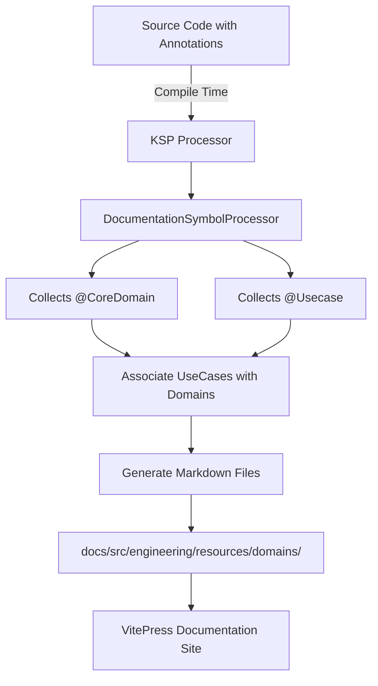

# Living Documentation

**Living Documentation** is documentation that evolves automatically with the code, ensuring that **the documentation is always in sync with the actual implementation**. Unlike traditional documentation that quickly becomes outdated, living documentation is generated from the source code itself, making it a single source of truth.

## 1️⃣ What is Living Documentation?

> Living Documentation is documentation that is always up-to-date because it is **automatically generated from the code** or tests, eliminating the risk of documentation drift.

**Key Benefits:**
- **Eliminates Documentation Drift**: Guarantees consistency between code and documentation
- **Reduces Maintenance**: Code and documentation are co-located and updated together
- **Improves Onboarding**: New team members get accurate, up-to-date information
- **Enforces Good Practices**: Encourages thoughtful design through required annotations
- **Supports DDD**: Makes bounded contexts, aggregates, and use cases explicit

## 2️⃣ Link with Domain-Driven Design (DDD)

Living Documentation and DDD are **natural companions**. DDD emphasizes creating a **Ubiquitous Language** shared by developers and domain experts. Living Documentation makes this language visible by:

- **Making domains explicit**: Each `@CoreDomain` becomes a documented bounded context
- **Documenting use cases**: Entry points to your domain are automatically listed and described
- **Creating shared vocabulary**: Annotations enforce meaningful names that domain experts and developers both understand

## 3️⃣ How it Works in This Project

The DrinkIt project implements Living Documentation using **Kotlin Symbol Processing (KSP)**, a compile-time annotation processing framework. The system automatically generates Markdown files from code annotations.

### 🏗️ Architecture Overview



### 🔧 Key Components

**1. Annotations** (`documentation-starter` module)

Two main annotations:
- `@CoreDomain`: Marks a class as a core domain entity
- `@Usecase`: Marks a class as a use case (interactor)

Both fall back to KDoc if description is not provided, and use `AnnotationRetention.SOURCE` for zero runtime overhead.

**2. Gradle Integration**

Apply `com.drinkit.documentation-convention` plugin to enable documentation generation:

```kotlin
plugins {
    id("com.drinkit.documentation-convention")
}
```

Generated files are placed in `docs/src/engineering/resources/`

---

## 4️⃣ Usage

### Annotate Your Code

**Domain entities:**
```kotlin
@CoreDomain(description = "Represents a user in the system")
data class User(val id: UserId, val email: Email)
```

**Use cases:**
```kotlin
@Usecase(description = "Registers a new user account")
@Service
class RegisterUser(private val userRepository: UserRepository) {
    fun execute(request: RegisterUserRequest): User { ... }
}
```

::: tip
You can also use KDoc instead of the `description` parameter. The `name` parameter is optional to override the class name.
:::

### Generate Documentation

```bash
./gradlew kspKotlin
```

Generated files are automatically published via CI/CD.

---

## Resources

::: tip Learn More
- [Living Documentation by Design - Cyrille Martraire](https://www.goodreads.com/book/show/34927405-living-documentation)
- [Domain-Driven Design - Eric Evans](https://www.domainlanguage.com/ddd/)
- [KSP Documentation](https://kotlinlang.org/docs/ksp-overview.html)
:::
