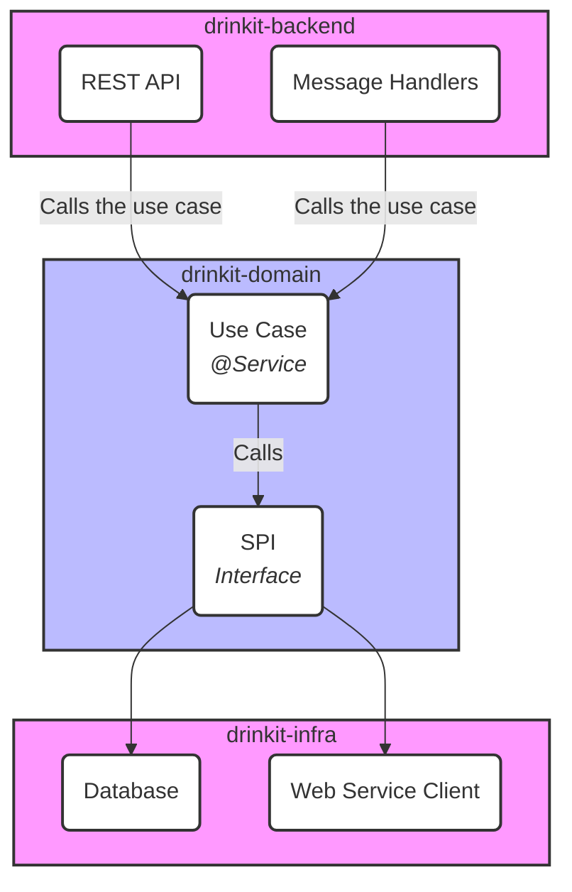

# Hexagonal Architecture

This page describes the software architecture of the **DrinkIt** project, which is based on the principles of **Hexagonal Architecture** (also known as **Ports & Adapters**). The goal of this architecture is to clearly separate business logic from technical details and external dependencies (like databases, external APIs, or user interfaces).

## 1️⃣ Principles

The core idea is to place the **business logic and data at the heart of the application** (the hexagon) and to communicate with the outside world through _"ports"_ and _"adapters"_.

### 🛸 The Hexagon (The Domain)

Contains the pure business logic, without any dependency on infrastructure technologies.

### 🧩 Ports

These are interfaces defined by the domain. There are two types of ports:

- 🔌 **Primary Ports (Driving Ports):** This is the domain's API, the use cases that the application exposes. They are called by external actors (e.g., a user via a REST API).

- 🧲 **Secondary Ports (Driven Ports / SPI):** These are the dependencies required by the domain, such as the need to persist data or send a notification. The domain defines the interface, but the implementation is external.

### 🔧 Adapters

These are the concrete implementations of the ports that connect the hexagon to the outside world.

- 🧭 **Primary Adapters (Driving Adapters):** They drive the application. Examples include REST controllers or message consumers that translate an external request into a call to a primary port of the domain.

- 🛠️ **Secondary Adapters (Driven Adapters):** They are driven by the application. These are the implementations of the secondary ports (e.g., a database access class, a client for an external web service).

---

## 2️⃣ Structure in Gradle Modules

To enforce this separation, the project is divided into **three distinct Gradle modules**. This physical structure enforces the dependency flow of the hexagonal architecture.

### 🧠 `drinkit-domain`

This is the core of the application, the hexagon. It is completely independent of the other layers.

**Responsibilities:**

- 🧱 Contain all business logic, organized into bounded contexts.
- 📜 Define secondary ports as interfaces (SPI - Service Provider Interface) for infrastructure needs (e.g., `UserRepository`, `NotificationService`).
- 🚪 Expose primary ports (use cases) through services.

**Dependency Rules:**  
This module must not depend on any other project module (`drinkit-backend` or `drinkit-infra`). It can have dependencies on external libraries not related to infrastructure (e.g., utils, starters).

::: info **📝 Note with Spring:**
For pragmatic reasons and to avoid boilerplate code (like creating Spring Beans who instanciate each domain usecase in drinkit-backend), the use of Spring annotations like `@Service` or `@Transactional` is allowed in this module. Spring is used here as a simple dependency injector, not as an infrastructure framework.
:::

---

### 🏗️ `drinkit-infra`

This module contains the **secondary adapters**. It provides the technical implementations for the interfaces defined in the domain.

**Responsibilities:**

- 🧩 Implement the interfaces (secondary ports) from the `drinkit-domain` module.
- 🗃️ Manage communication with the database (e.g., with Jooq DSL, datasource configuration).
- 🌐 Contain clients for calling external web services.
- ⚙️ Handle any other technical aspects (file system, message bus, etc.).

**Dependency Rules:**  
This module only depends on `drinkit-domain`.

---

### 🚪 `drinkit-backend`

This module contains the primary adapters. It's the application's **entry point**.

**Responsibilities:**

- 🌍 Expose REST APIs (e.g., using OpenAPI generated classes and Spring MVC).
- 📥 Contain handlers for asynchronous messages (e.g., RabbitMQ Listeners).
- 🔁 Translate HTTP requests or messages into calls to the services in `drinkit-domain`.

**Dependency Rules:**  
This module depends on `drinkit-domain` and `drinkit-infra` (only to register infra services from the dependency injection framework). 
It does not have access to classes and dependencies of `drinkit-infra`, which ensures that a controller cannot directly call a persistence implementation class.

---

## 🧭 Architecture Diagram

The diagram below illustrates the communication flows and dependencies between the modules. The call originates from a **primary adapter** (`drinkit-backend`), goes through the **domain** (`drinkit-domain`), which uses an interface (**secondary port**) whose implementation is provided by a **secondary adapter** (`drinkit-infra`).

