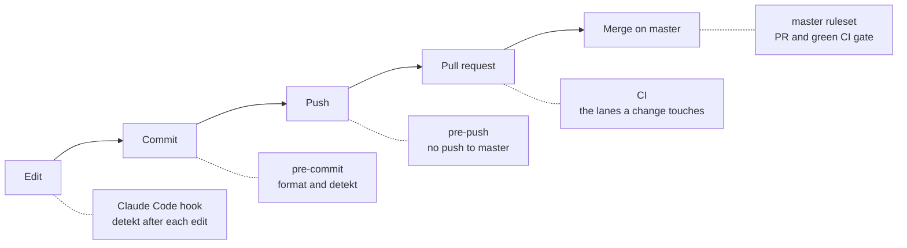

# Harness

The harness is the set of guardrails that lets humans and coding agents change DrinkIt without breaking master. Each layer catches a mistake as early as it can, and no layer relies on the previous one having run.

Local layers can be skipped with `--no-verify`. The GitHub layers cannot, owner included.

## Coding agent

| Part | What it does | Where | Since |
|---|---|---|---|
| Conventions | Stack, commands and patterns an agent reads when a session starts | [`CLAUDE.md`][claude-md] | 2026-05-01 |
| Lint hook | Runs detekt with auto-correct after every file Claude Code writes, so it sees its findings at once | [`.claude/settings.json`][claude-settings] | 2026-09-13 |
| Skill `new-backend-tech-starter` | Guides the creation of a backend tech starter, or its alignment with the conventions | [`.claude/skills/new-backend-tech-starter`][skill-starter] | 2026-09-19 |

## Git hooks

Enabled once per clone with `git config core.hooksPath .githooks`.

| Part | What it does | Where | Since |
|---|---|---|---|
| `lint-kotlin` | Formats Kotlin sources and Gradle scripts, fails when detekt does. Shared by `pre-commit` and Claude Code | [`.githooks/lint-kotlin`][lint-kotlin] | 2026-09-13 |
| `pre-commit` | When Kotlin files are staged, runs `lint-kotlin` and re-stages what it reformatted | [`.githooks/pre-commit`][pre-commit] | 2026-09-13 |
| `pre-push` | Refuses any push, force push or deletion of master before anything is sent | [`.githooks/pre-push`][pre-push] | 2026-09-27 |

## Gradle

| Part | What it does | Where | Since |
|---|---|---|---|
| detekt convention plugin | Applies detekt with type resolution to every module, skips generated code, makes `check` run `detektAll` | [`com.drinkit.code-analysis-convention`][detekt-convention] | 2024-03-17, fails the build since 2026-09-13 |
| detekt configuration | This project's deviations from detekt's defaults, formatting rules included | [`code-analysis/detekt/detekt.yml`][detekt-yml] | 2024-03-17 |
| detekt baseline | Findings older than the switch to failing builds. They no longer block, new ones do | [`code-analysis/detekt/baseline.xml`][detekt-baseline] | 2024-03-17 |
| Wrapper checksum | The wrapper refuses a Gradle distribution whose SHA-256 differs from the committed one. Renovate updates it with each Gradle version | [`gradle-wrapper.properties`][wrapper-properties] | 2026-09-30 |

## Continuous integration

One workflow, `ci.yml`, runs the lanes a change touches, each from a file of its own. [CI/CD](./ci-cd) explains the lanes and the choices behind them.

| Part | What it does | Where | Since |
|---|---|---|---|
| `CI gate` | The only required check. Fails when a lane failed or was cancelled, passes when a lane was not needed | [`ci.yml`][ci-yml] | 2026-10-01 |
| `Decision` | Maps the changed files to the ci, backend, frontend, docs, ops and dependencies lanes. A file no list knows runs every lane | [`ci-lanes.yml`][ci-lanes] | 2026-10-01 |
| `CI files` | actionlint checks that the workflows are valid and zizmor audits their security, whenever they change. A finding blocks the merge | [`ci-ci.yml`][ci-ci-yml] | 2026-10-02 |
| `Backend` | Compiles and tests the backend and runs detekt in one Gradle run, findings in code scanning | [`ci-backend.yml`][ci-backend-yml] | 2024-03-03 as `build`, detekt in the same run since 2026-10-01 |
| `CodeQL` | Looks for security flaws in the Kotlin and Java code, results in code scanning. Not required | [`ci-codeql.yml`][ci-codeql-yml] | 2024-03-25, off from 2026-09-13 to 2026-09-26 |
| `Frontend` | Generates the API client and builds the Nuxt app | [`ci-frontend.yml`][ci-frontend-yml] | 2026-10-01 |
| `Ops` | Validates the local compose file | [`ci-ops.yml`][ci-ops-yml] | 2026-10-01 |
| `Docs` and `Deploy docs` | Generate the living documentation and build the site on pull requests, deploy that build from master | [`ci-docs.yml`][ci-docs-yml], [`cd-docs.yml`][cd-docs-yml] | deployed since 2025-07-03, built on pull requests since 2026-10-01 |
| `Dependencies`: graph submission | Sends the Gradle dependency graph to GitHub for every master commit and for pull requests that change dependencies | [`ci-dependencies.yml`][ci-dependencies-yml] | 2024-03-25, nothing sent from 2025-01-25 to 2026-09-27 |
| `Dependencies`: review | Fails a pull request that adds a dependency with a known vulnerability | [`ci-dependencies.yml`][ci-dependencies-yml] | 2026-10-01 |
| Weekly full run | Runs every lane on master each Monday, CodeQL on all the code included | [`weekly.yml`][weekly-yml] | 2026-10-01 |
| Gradle wrapper validation | Checks that the Gradle wrapper is an official release, in every Gradle setup | [`setup-gradle-jdk`][setup-action] | 2024-03-25, in the shared setup since 2026-10-01 |

## GitHub configuration

| Part | What it does | Where | Since |
|---|---|---|---|
| master ruleset | No bypass, owner and agents included. Pull request required, `CI gate` green on a branch up to date with master, conversations resolved, no force push, no deletion | [`.github/rulesets/master.json`][ruleset] | 2026-09-27 |
| Merge settings | Rebase is the only merge method, "Update branch" is offered, merged branches are deleted | Repository settings | 2026-09-27 |
| Workflow token | Read-only by default, each workflow asks for what it needs | Repository settings | Not recorded |
| Fork pull requests | Workflows of every external contributor wait for approval | Repository settings | 2026-10-02, first-time contributors only before |
| Pinned actions | A workflow that references an action by tag or branch does not start: every action is pinned by commit SHA, in-repo ones with `$/` | Repository settings | 2026-10-02 |
| Renovate | Opens dependency update pull requests a week after a release, on Monday mornings, and pins GitHub Actions and compose images by digest. Security fixes and undated releases (JDK, large Docker Hub images) skip the wait. Majors and lock file refreshes wait for a checkbox on the Dependency Dashboard. A pull request is rebased only on conflict | [`.github/renovate.json`][renovate] | 2024-04-11, delayed since 2026-09-30, rebased on conflict only since 2026-10-01 |
| Dependabot alerts | Flag dependencies with a known vulnerability, which Renovate turns into security updates. Dependabot opens no pull request of its own | Repository settings | Not recorded, its security updates off since 2026-10-01 |
| Gradle configuration cache key | The `GRADLE_ENCRYPTION_KEY` secret lets `Backend` keep Gradle's configuration cache between runs | Repository secrets | 2026-10-01 |

## Not covered yet

- An agent session holds the owner's token, which can still edit the ruleset: [#405][i405], then [#407][i407]
- Secret scanning and dependency verification: [#402][i402]
- Container images and a deployment for the backend and frontend: [#421][i421]
- Detekt and coverage reports on every pull request: [#404][i404]
- Documentation generation as part of the build: [#395][i395]
- Frontend upgrade, then its linting and tests in the frontend lane: [#388][i388], then [#400][i400]
- A repeatable agent workflow from issue to pull request, with a judge: [#382][i382]

[claude-md]: https://github.com/mboisnard/drinkit/blob/master/CLAUDE.md
[claude-settings]: https://github.com/mboisnard/drinkit/blob/master/.claude/settings.json
[skill-starter]: https://github.com/mboisnard/drinkit/blob/master/.claude/skills/new-backend-tech-starter/SKILL.md
[lint-kotlin]: https://github.com/mboisnard/drinkit/blob/master/.githooks/lint-kotlin
[pre-commit]: https://github.com/mboisnard/drinkit/blob/master/.githooks/pre-commit
[pre-push]: https://github.com/mboisnard/drinkit/blob/master/.githooks/pre-push
[detekt-convention]: https://github.com/mboisnard/drinkit/blob/master/build-logic/src/main/kotlin/quality/com.drinkit.code-analysis-convention.gradle.kts
[detekt-yml]: https://github.com/mboisnard/drinkit/blob/master/code-analysis/detekt/detekt.yml
[detekt-baseline]: https://github.com/mboisnard/drinkit/blob/master/code-analysis/detekt/baseline.xml
[wrapper-properties]: https://github.com/mboisnard/drinkit/blob/master/gradle/wrapper/gradle-wrapper.properties
[ci-yml]: https://github.com/mboisnard/drinkit/blob/master/.github/workflows/ci.yml
[ci-lanes]: https://github.com/mboisnard/drinkit/blob/master/.github/workflows/config/ci-lanes.yml
[ci-ci-yml]: https://github.com/mboisnard/drinkit/blob/master/.github/workflows/ci-ci.yml
[ci-backend-yml]: https://github.com/mboisnard/drinkit/blob/master/.github/workflows/ci-backend.yml
[ci-codeql-yml]: https://github.com/mboisnard/drinkit/blob/master/.github/workflows/ci-codeql.yml
[ci-frontend-yml]: https://github.com/mboisnard/drinkit/blob/master/.github/workflows/ci-frontend.yml
[ci-ops-yml]: https://github.com/mboisnard/drinkit/blob/master/.github/workflows/ci-ops.yml
[ci-docs-yml]: https://github.com/mboisnard/drinkit/blob/master/.github/workflows/ci-docs.yml
[cd-docs-yml]: https://github.com/mboisnard/drinkit/blob/master/.github/workflows/cd-docs.yml
[ci-dependencies-yml]: https://github.com/mboisnard/drinkit/blob/master/.github/workflows/ci-dependencies.yml
[weekly-yml]: https://github.com/mboisnard/drinkit/blob/master/.github/workflows/weekly.yml
[setup-action]: https://github.com/mboisnard/drinkit/blob/master/.github/actions/setup-gradle-jdk/action.yml
[ruleset]: https://github.com/mboisnard/drinkit/blob/master/.github/rulesets/master.json
[renovate]: https://github.com/mboisnard/drinkit/blob/master/.github/renovate.json
[i405]: https://github.com/mboisnard/drinkit/issues/405
[i407]: https://github.com/mboisnard/drinkit/issues/407
[i402]: https://github.com/mboisnard/drinkit/issues/402
[i421]: https://github.com/mboisnard/drinkit/issues/421
[i404]: https://github.com/mboisnard/drinkit/issues/404
[i395]: https://github.com/mboisnard/drinkit/issues/395
[i388]: https://github.com/mboisnard/drinkit/issues/388
[i400]: https://github.com/mboisnard/drinkit/issues/400
[i382]: https://github.com/mboisnard/drinkit/issues/382
