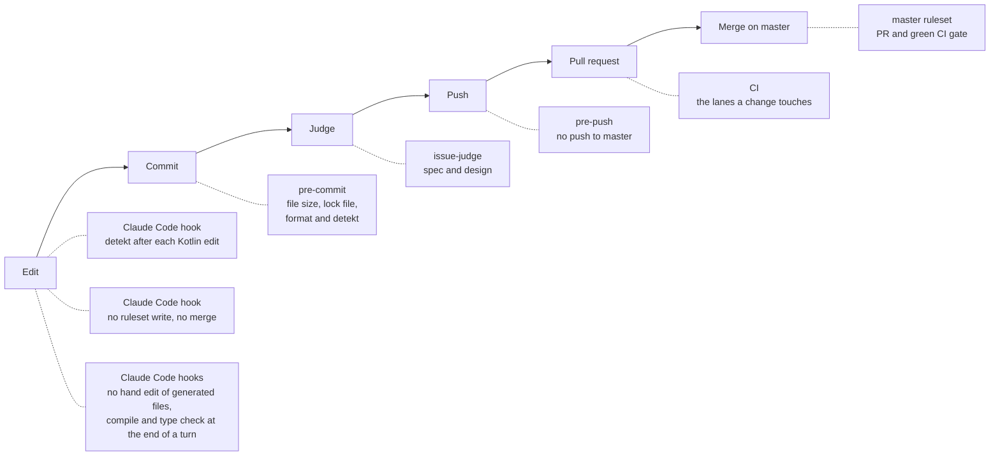

# Harness

The harness is the set of guardrails that lets humans and coding agents change DrinkIt without breaking master. Each layer catches a mistake as early as it can, and no layer relies on the previous one having run.

A person can skip the local git hooks with `--no-verify`, a Claude Code session cannot skip pre-push. The GitHub layers cannot be skipped, owner included.

## Coding agent

`/implement-issue <number>` takes a Ready issue to a pull request: a worktree of its own, the code test first, the lanes CI would run, a fresh judge, then the pull request and the board moves. The maintainer merges.

| Part | What it does | Where | Since |
|---|---|---|---|
| Conventions | Commands, structure, code patterns and traps a coding agent reads when a session starts. Claude Code, Codex, Copilot and Cursor all read the file | [`AGENTS.md`][agents-md] | 2026-05-01 as `CLAUDE.md`, `AGENTS.md` since 2026-10-03 |
| Agent `issue-judge` | A fresh subagent that sees the issue and the branch, not the author's account of it. It reruns the tests it relies on and returns two verdicts: Spec, each acceptance criterion met, and Design, the refactor done and the guidelines followed. Two rounds at most, then the maintainer decides | [`.claude/agents/issue-judge.md`][issue-judge] | 2026-10-03 |
| Agent `security-reviewer` | A fresh, read-only subagent that reviews a branch for security: authorization of each endpoint, CSRF, CORS, headers, input validation, secrets, new dependencies, the frontend's handling of user input. `implement-issue` starts it when the diff touches one of those | [`.claude/agents/security-reviewer.md`][security-reviewer] | 2026-10-03 |
| Lint hook | Once Claude Code writes a Kotlin source or a Gradle script, runs `lint-kotlin` from its worktree, and shows Claude the findings when detekt fails | [`.claude/hooks/detekt-after-edit`][detekt-hook] | 2026-09-13, Kotlin only and findings shown since 2026-10-03 |
| Guard hook | Refuses, before it runs, a command that writes to a ruleset, to branch protection or to a push protection bypass, or that merges a pull request, through `gh`, `gh api`, GraphQL or `curl`. Also refuses any way around pre-push: `--no-verify`, an overridden or unset `core.hooksPath`, a push from a clone without the git hooks. Reads pass, and so does text inside quotes or a heredoc that no shell reads. It reads the command as text, so one built indirectly, through a variable or a script, passes. `permissions.deny` in the same settings refuses `gh pr merge` and `git push --no-verify` a second time | [`.claude/hooks/guard-github-protections`][guard-hook] | 2026-10-02, merges and pre-push since 2026-10-03 |
| cmux status hook | In the cmux terminal, names the session's tab after its issue and step, `#382 implement`, `#382 judge`, `#382 PR #450`, and shows the judge's verdict and the pull request's CI gate as sidebar pills, read from `gh pr checks` whether it passes or fails. Does nothing elsewhere | [`.claude/hooks/cmux-status`][cmux-status] | 2026-10-03 |
| Generated files hook | Refuses a hand edit of a file a tool writes: jOOQ classes, the generated API client, Gradle's and npm's lock files, the generated documentation pages, and `.env` files. Its message names the command that changes the file instead. A shell command that writes the file passes | [`.claude/hooks/protect-generated-files`][protect-hook] | 2026-10-03 |
| Compile hook | At the end of a turn that changed Kotlin sources, compiles them with their tests. When frontend sources changed, runs the `typecheck` script of each app that has one and has its dependencies installed. The errors go back to Claude, which keeps working until they are fixed. A state already checked is not checked again, so it cannot loop | [`.claude/hooks/compile-at-stop`][compile-hook] | 2026-10-03 |
| Session context hook | At start, on resume and after a compaction, tells Claude its branch, its issue, how far it is ahead of master and its uncommitted work | [`.claude/hooks/session-context`][session-hook] | 2026-10-03 |

Each Claude Code hook has a test next to it, `<hook>.test`, and so do `pre-commit` and `pre-push`, run by hand for now. Claude Code also loads the personal configuration of whoever runs it, from `~/.claude`, on top of these parts, and a project cannot turn it off.

### Skills

A skill holds how to carry out one kind of change. Claude loads it when the files it names are touched, or when
it is asked for, and other agents are told to read it by `AGENTS.md`.

| Skill | When it applies | Started by |
|---|---|---|
| [`implement-issue`][skill-issue] | Taking a Ready issue to a pull request | The maintainer, `/implement-issue <number>` |
| [`new-issue`][skill-new-issue] | Turning an idea, a bug or discovered work into an issue that follows its form | On request, or by `implement-issue` |
| [`review-pr`][skill-review-pr] | Reviewing a pull request and posting inline comments ranked by severity | The maintainer, `/review-pr <number>` |
| [`test-driven-development`][skill-tdd] | Adding or changing behavior, backend or frontend: a test list, red-green-tidy cycles, then a technical and functional refactor | Code under `drinkit/` or a backend starter |
| [`test-existing-code`][skill-test-existing] | Covering code that works but has no tests, each test proven able to fail | On request |
| [`hexagonal-backend`][skill-hexagonal] | Where each piece of a backend feature goes, from use case to controller and security rule | Backend production code |
| [`api-contract-change`][skill-contract] | Changing the OpenAPI contract, then both generated sides | The contract and the client generator settings |
| [`database-change`][skill-database] | Changing the schema in place, idempotently, then the jOOQ classes and their tests | The changelogs and the generated jOOQ code |
| [`frontend-feature`][skill-frontend] | Shaping a feature of the Nuxt app around the generated client | Frontend sources |
| [`new-backend-tech-starter`][skill-starter] | Creating a backend tech starter, or aligning one with the conventions | On request |
| [`new-frontend-tech-starter`][skill-frontend-starter] | Creating the first frontend tech starter, a Nuxt layer, once its layout is agreed | On request |
| [`pentest`][skill-pentest] | Scanning the running application locally with OWASP ZAP, then triaging the findings | The maintainer, `/pentest` |
| [`threat-model`][skill-threat-model] | A STRIDE threat model of one feature or flow | The maintainer, `/threat-model` |

## Git hooks

Enabled once per clone with `git config core.hooksPath .githooks`.

| Part | What it does | Where | Since |
|---|---|---|---|
| `lint-kotlin` | Formats Kotlin sources and Gradle scripts, fails when detekt does. Shared by `pre-commit` and Claude Code | [`.githooks/lint-kotlin`][lint-kotlin] | 2026-09-13 |
| `pre-commit` | Refuses a staged file over 5 MB, and a dependency change in a `package.json` without its `package-lock.json`. When Kotlin files are staged, runs `lint-kotlin` and re-stages what it reformatted | [`.githooks/pre-commit`][pre-commit] | 2026-09-13, size and lock file checks since 2026-10-03 |
| `pre-push` | Refuses any push, force push or deletion of master before anything is sent | [`.githooks/pre-push`][pre-push] | 2026-09-27 |

## Gradle

| Part | What it does | Where | Since |
|---|---|---|---|
| detekt convention plugin | Applies detekt with type resolution to every module, skips generated code, makes `check` run `detektAll` | [`com.drinkit.code-analysis-convention`][detekt-convention] | 2024-03-17, fails the build since 2026-09-13 |
| detekt configuration | This project's deviations from detekt's defaults, formatting rules included | [`code-analysis/detekt/detekt.yml`][detekt-yml] | 2024-03-17 |
| detekt baseline | Findings older than the switch to failing builds. They no longer block, new ones do | [`code-analysis/detekt/baseline.xml`][detekt-baseline] | 2024-03-17 |
| Wrapper checksum | The wrapper refuses a Gradle distribution whose SHA-256 differs from the committed one. Renovate updates it with each Gradle version | [`gradle-wrapper.properties`][wrapper-properties] | 2026-09-30 |
| Dependency verification | The build refuses a dependency or plugin whose SHA-256 differs from the committed one, or has none. Renovate regenerates the file in its own pull requests. Sources, javadoc and two artifacts that plugins resolve on their own are trusted, each with its reason | [`verification-metadata.xml`][verification-metadata] | 2026-10-02 |
| Dependency locking | `drinkit-backend` resolves exactly the versions its `gradle.lockfile` lists, transitive and test dependencies included. The libraries are not locked, so a new release inside a version range they ask for, cucumber's for instance, fails verification until the files are regenerated | [`com.drinkit.api-convention`][api-convention] | 2026-10-03 |

## Continuous integration

One workflow, `ci.yml`, runs the lanes a change touches, each from a file of its own. [CI/CD](./ci-cd) explains the lanes and the choices behind them.

| Part | What it does | Where | Since |
|---|---|---|---|
| `CI gate` | The only required check. Fails when a lane failed or was cancelled, passes when a lane was not needed | [`ci.yml`][ci-yml] | 2026-10-01 |
| `Decision` | Maps the changed files to the workflows, backend, frontend, docs, ops and dependencies lanes. A file no list knows runs every lane | [`ci-lanes.yml`][ci-lanes] | 2026-10-01 |
| `CI files` | actionlint checks that the workflows are valid and zizmor audits their security, whenever they change. A finding blocks the merge | [`ci-workflows.yml`][ci-workflows-yml] | 2026-10-02 |
| `Backend` | Compiles and tests the backend and runs detekt in one Gradle run, findings in code scanning | [`ci-backend.yml`][ci-backend-yml] | 2024-03-03 as `build`, detekt in the same run since 2026-10-01 |
| `CodeQL` | Looks for security flaws in the Kotlin and Java code, results in code scanning. Not required | [`ci-codeql.yml`][ci-codeql-yml] | 2024-03-25, off from 2026-09-13 to 2026-09-26 |
| `Frontend` | Generates the API client and builds the Nuxt app | [`ci-frontend.yml`][ci-frontend-yml] | 2026-10-01 |
| `Ops` | Validates the local compose file | [`ci-ops.yml`][ci-ops-yml] | 2026-10-01 |
| `Docs` and `Deploy docs` | Generate the living documentation and build the site on pull requests, deploy that build from master | [`ci-docs.yml`][ci-docs-yml], [`cd-docs.yml`][cd-docs-yml] | deployed since 2025-07-03, built on pull requests since 2026-10-01 |
| `Dependencies`: graph submission | Sends the Gradle dependency graph to GitHub for every master commit and for pull requests that change dependencies | [`ci-dependencies.yml`][ci-dependencies-yml] | 2024-03-25, nothing sent from 2025-01-25 to 2026-09-27 |
| `Dependencies`: review | Fails a pull request that adds a dependency with a known vulnerability | [`ci-dependencies.yml`][ci-dependencies-yml] | 2026-10-01 |
| Weekly full run | Runs every lane on master each Monday, CodeQL on all the code included | [`weekly.yml`][weekly-yml] | 2026-10-01 |
| Gradle wrapper validation | Checks that the Gradle wrapper is an official release, in every Gradle setup | [`setup-gradle-jdk`][setup-action] | 2024-03-25, in the shared setup since 2026-10-01 |

## GitHub configuration

| Part | What it does | Where | Since |
|---|---|---|---|
| master ruleset | No bypass, owner and agents included. Pull request required, `CI gate` green on a branch up to date with master, conversations resolved, no force push, no deletion | [`.github/rulesets/master.json`][ruleset] | 2026-09-27 |
| Merge settings | Rebase is the only merge method, "Update branch" is offered, merged branches are deleted | Repository settings | 2026-09-27 |
| Workflow token | Read-only by default, each workflow asks for what it needs | Repository settings | Not recorded |
| Fork pull requests | Workflows of every external contributor wait for approval | Repository settings | 2026-10-02, first-time contributors only before |
| Pinned actions | A workflow that references an action by tag or branch does not start: every action is pinned by commit SHA, in-repo ones with `$/` | Repository settings | 2026-10-02 |
| Renovate | Opens dependency update pull requests a week after a release, on Monday mornings, and pins GitHub Actions and compose images by digest. Security fixes and undated releases (JDK, large Docker Hub images) skip the wait. Majors and lock file refreshes wait for a checkbox on the Dependency Dashboard. A pull request is rebased only on conflict | [`.github/renovate.json`][renovate] | 2024-04-11, delayed since 2026-09-30, rebased on conflict only since 2026-10-01 |
| Dependabot alerts | Flag dependencies with a known vulnerability, which Renovate turns into security updates. Dependabot opens no pull request of its own | Repository settings | Not recorded, its security updates off since 2026-10-01 |
| Secret scanning and push protection | GitHub refuses a push that contains a known secret format, from git, the web interface or the API, and scans the whole history for secrets already pushed | Repository settings | 2026-10-02 |
| Private vulnerability reporting | A vulnerability can be reported from the Security tab, without a public issue. `SECURITY.md` points there | Repository settings, [`SECURITY.md`][security-md] | 2026-10-02, policy since 2026-10-03 |
| Issue forms | "New issue" offers a work item, an epic and a bug form. Only collaborators can still open a blank issue. Forms only apply on github.com, so `AGENTS.md` tells agents to reuse their headings | [`.github/ISSUE_TEMPLATE`][issue-forms] | 2026-10-03 |
| Pull request template | Prefills a new pull request: what changes and why, `Closes #`, choices, verification | [`pull_request_template.md`][pr-template] | 2026-10-03 |
| Contributing guide | How to write issues and pull requests for a human reader, by people and agents alike. GitHub links it when an issue or a pull request is opened | [`CONTRIBUTING.md`][contributing] | 2026-10-03 |
| Gradle configuration cache key | The `GRADLE_ENCRYPTION_KEY` secret lets `Backend` keep Gradle's configuration cache between runs | Repository secrets | 2026-10-01 |

## Not covered yet

- An agent session holds the owner's admin token: only the guard hook keeps it from editing the ruleset
- Container images and a deployment for the backend and frontend: [#421][i421]
- Detekt and coverage reports on every pull request: [#404][i404]
- Documentation generation as part of the build: [#395][i395]
- Frontend upgrade, then its linting and tests in the frontend lane: [#388][i388], then [#400][i400]
- The judge is required by `/implement-issue`, not by a hook: the pull request shows its verdict line, which the maintainer checks before merging
- The hook tests run by hand, not in CI: [#434][i434]

[agents-md]: https://github.com/mboisnard/drinkit/blob/master/AGENTS.md
[skill-issue]: https://github.com/mboisnard/drinkit/blob/master/.claude/skills/implement-issue/SKILL.md
[skill-tdd]: https://github.com/mboisnard/drinkit/blob/master/.claude/skills/test-driven-development/SKILL.md
[issue-judge]: https://github.com/mboisnard/drinkit/blob/master/.claude/agents/issue-judge.md
[security-reviewer]: https://github.com/mboisnard/drinkit/blob/master/.claude/agents/security-reviewer.md
[skill-new-issue]: https://github.com/mboisnard/drinkit/blob/master/.claude/skills/new-issue/SKILL.md
[skill-review-pr]: https://github.com/mboisnard/drinkit/blob/master/.claude/skills/review-pr/SKILL.md
[skill-test-existing]: https://github.com/mboisnard/drinkit/blob/master/.claude/skills/test-existing-code/SKILL.md
[skill-hexagonal]: https://github.com/mboisnard/drinkit/blob/master/.claude/skills/hexagonal-backend/SKILL.md
[skill-contract]: https://github.com/mboisnard/drinkit/blob/master/.claude/skills/api-contract-change/SKILL.md
[skill-database]: https://github.com/mboisnard/drinkit/blob/master/.claude/skills/database-change/SKILL.md
[skill-frontend]: https://github.com/mboisnard/drinkit/blob/master/.claude/skills/frontend-feature/SKILL.md
[skill-frontend-starter]: https://github.com/mboisnard/drinkit/blob/master/.claude/skills/new-frontend-tech-starter/SKILL.md
[skill-pentest]: https://github.com/mboisnard/drinkit/blob/master/.claude/skills/pentest/SKILL.md
[skill-threat-model]: https://github.com/mboisnard/drinkit/blob/master/.claude/skills/threat-model/SKILL.md
[detekt-hook]: https://github.com/mboisnard/drinkit/blob/master/.claude/hooks/detekt-after-edit
[guard-hook]: https://github.com/mboisnard/drinkit/blob/master/.claude/hooks/guard-github-protections
[cmux-status]: https://github.com/mboisnard/drinkit/blob/master/.claude/hooks/cmux-status
[protect-hook]: https://github.com/mboisnard/drinkit/blob/master/.claude/hooks/protect-generated-files
[compile-hook]: https://github.com/mboisnard/drinkit/blob/master/.claude/hooks/compile-at-stop
[session-hook]: https://github.com/mboisnard/drinkit/blob/master/.claude/hooks/session-context
[skill-starter]: https://github.com/mboisnard/drinkit/blob/master/.claude/skills/new-backend-tech-starter/SKILL.md
[lint-kotlin]: https://github.com/mboisnard/drinkit/blob/master/.githooks/lint-kotlin
[pre-commit]: https://github.com/mboisnard/drinkit/blob/master/.githooks/pre-commit
[pre-push]: https://github.com/mboisnard/drinkit/blob/master/.githooks/pre-push
[detekt-convention]: https://github.com/mboisnard/drinkit/blob/master/build-logic/src/main/kotlin/quality/com.drinkit.code-analysis-convention.gradle.kts
[detekt-yml]: https://github.com/mboisnard/drinkit/blob/master/code-analysis/detekt/detekt.yml
[detekt-baseline]: https://github.com/mboisnard/drinkit/blob/master/code-analysis/detekt/baseline.xml
[wrapper-properties]: https://github.com/mboisnard/drinkit/blob/master/gradle/wrapper/gradle-wrapper.properties
[verification-metadata]: https://github.com/mboisnard/drinkit/blob/master/gradle/verification-metadata.xml
[api-convention]: https://github.com/mboisnard/drinkit/blob/master/build-logic/src/main/kotlin/archetype/com.drinkit.api-convention.gradle.kts
[ci-yml]: https://github.com/mboisnard/drinkit/blob/master/.github/workflows/ci.yml
[ci-lanes]: https://github.com/mboisnard/drinkit/blob/master/.github/workflows/config/ci-lanes.yml
[ci-workflows-yml]: https://github.com/mboisnard/drinkit/blob/master/.github/workflows/ci-workflows.yml
[ci-backend-yml]: https://github.com/mboisnard/drinkit/blob/master/.github/workflows/ci-backend.yml
[ci-codeql-yml]: https://github.com/mboisnard/drinkit/blob/master/.github/workflows/ci-codeql.yml
[ci-frontend-yml]: https://github.com/mboisnard/drinkit/blob/master/.github/workflows/ci-frontend.yml
[ci-ops-yml]: https://github.com/mboisnard/drinkit/blob/master/.github/workflows/ci-ops.yml
[ci-docs-yml]: https://github.com/mboisnard/drinkit/blob/master/.github/workflows/ci-docs.yml
[cd-docs-yml]: https://github.com/mboisnard/drinkit/blob/master/.github/workflows/cd-docs.yml
[ci-dependencies-yml]: https://github.com/mboisnard/drinkit/blob/master/.github/workflows/ci-dependencies.yml
[weekly-yml]: https://github.com/mboisnard/drinkit/blob/master/.github/workflows/weekly.yml
[setup-action]: https://github.com/mboisnard/drinkit/blob/master/.github/actions/setup-gradle-jdk/action.yml
[ruleset]: https://github.com/mboisnard/drinkit/blob/master/.github/rulesets/master.json
[renovate]: https://github.com/mboisnard/drinkit/blob/master/.github/renovate.json
[security-md]: https://github.com/mboisnard/drinkit/blob/master/SECURITY.md
[issue-forms]: https://github.com/mboisnard/drinkit/tree/master/.github/ISSUE_TEMPLATE
[pr-template]: https://github.com/mboisnard/drinkit/blob/master/.github/pull_request_template.md
[contributing]: https://github.com/mboisnard/drinkit/blob/master/CONTRIBUTING.md
[i421]: https://github.com/mboisnard/drinkit/issues/421
[i404]: https://github.com/mboisnard/drinkit/issues/404
[i395]: https://github.com/mboisnard/drinkit/issues/395
[i388]: https://github.com/mboisnard/drinkit/issues/388
[i400]: https://github.com/mboisnard/drinkit/issues/400
[i434]: https://github.com/mboisnard/drinkit/issues/434
