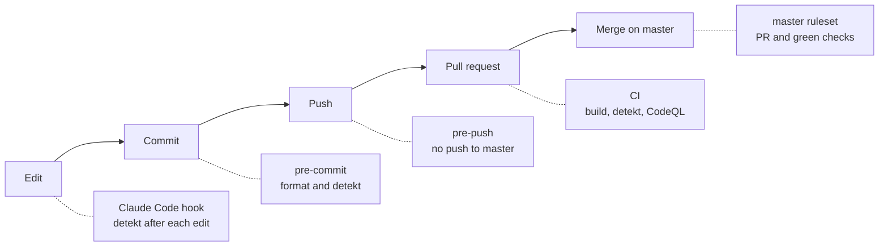

# Harness

The harness is the set of guardrails that lets humans and coding agents change DrinkIt without breaking master. Each layer catches a mistake as early as it can, and no layer relies on the previous one having run.

Local layers can be skipped with `--no-verify`. The GitHub layers cannot, owner included.

## Coding agent

| Part | What it does | Where | Since |
|---|---|---|---|
| Conventions | Stack, commands and patterns an agent reads when a session starts | [`CLAUDE.md`][claude-md] | 2026-05-01 |
| Lint hook | Runs detekt with auto-correct after every file Claude Code writes, so it sees its findings at once | [`.claude/settings.json`][claude-settings] | 2026-09-13 |
| Skill `new-backend-tech-starter` | Guides the creation of a backend tech starter, or its alignment with the conventions | [`.claude/skills/new-backend-tech-starter`][skill-starter] | 2026-09-19 |

## Git hooks

Enabled once per clone with `git config core.hooksPath .githooks`.

| Part | What it does | Where | Since |
|---|---|---|---|
| `lint-kotlin` | Formats Kotlin sources and Gradle scripts, fails when detekt does. Shared by `pre-commit` and Claude Code | [`.githooks/lint-kotlin`][lint-kotlin] | 2026-09-13 |
| `pre-commit` | When Kotlin files are staged, runs `lint-kotlin` and re-stages what it reformatted | [`.githooks/pre-commit`][pre-commit] | 2026-09-13 |
| `pre-push` | Refuses any push, force push or deletion of master before anything is sent | [`.githooks/pre-push`][pre-push] | 2026-09-27 |

## Gradle

| Part | What it does | Where | Since |
|---|---|---|---|
| detekt convention plugin | Applies detekt with type resolution to every module, skips generated code, makes `check` run `detektAll` | [`com.drinkit.code-analysis-convention`][detekt-convention] | 2024-03-17, fails the build since 2026-09-13 |
| detekt configuration | This project's deviations from detekt's defaults, formatting rules included | [`code-analysis/detekt/detekt.yml`][detekt-yml] | 2024-03-17 |
| detekt baseline | Findings older than the switch to failing builds. They no longer block, new ones do | [`code-analysis/detekt/baseline.xml`][detekt-baseline] | 2024-03-17 |

## Continuous integration

| Part | What it does | Where | Since |
|---|---|---|---|
| `build` | Compiles and tests the backend on every pull request and on master. Required | [`build.yml`][build-yml] | 2024-03-03, on pull requests since 2026-09-27 |
| `Detekt - Static Code Analysis` | Runs `detektAll` and publishes the findings to code scanning. Required | [`code-analysis.yml`][code-analysis-yml] | 2024-03-25 |
| `CodeQL - Security Analysis` | Looks for security flaws in the Kotlin and Java code, results in code scanning. Not required | [`code-analysis.yml`][code-analysis-yml] | 2024-03-25, off from 2026-09-13 to 2026-09-26 |
| Dependency submission | Sends the Gradle dependency graph to GitHub, which feeds Dependabot alerts and Renovate security updates | [`dependency-submission.yml`][dependency-submission-yml] | 2024-03-25, nothing sent from 2025-01-25 to 2026-09-27 |
| Gradle wrapper validation | Checks that a changed Gradle wrapper is an official release | [`gradle-wrapper-validation.yml`][wrapper-validation-yml] | 2024-03-25 |

## GitHub configuration

| Part | What it does | Where | Since |
|---|---|---|---|
| master ruleset | No bypass, owner and agents included. Pull request required, `build` and detekt green on a branch up to date with master, conversations resolved, no force push, no deletion | [`.github/rulesets/master.json`][ruleset] | 2026-09-27 |
| Merge settings | Rebase is the only merge method, "Update branch" is offered, merged branches are deleted | Repository settings | 2026-09-27 |
| Workflow token | Read-only by default, each workflow asks for what it needs | Repository settings | Not recorded |
| Fork pull requests | Workflows of a first-time contributor wait for approval | Repository settings | Not recorded |
| Renovate | Opens dependency update pull requests a week after a release, on Monday mornings, and pins GitHub Actions and compose images by digest. Security fixes and undated releases (JDK, large Docker Hub images) skip the wait. Majors and lock file refreshes wait for a checkbox on the Dependency Dashboard | [`.github/renovate.json`][renovate] | 2024-04-11, delayed since 2026-09-30 |
| Dependabot security updates | Opens a pull request when a dependency has a known vulnerability | Repository settings | Not recorded |

## Not covered yet

- An agent session holds the owner's token, which can still edit the ruleset: [#405][i405], then [#407][i407]
- Security analysis of the workflows and actions pinned by commit: [#406][i406]
- Secret scanning and dependency verification: [#402][i402]
- A single dependency bot, and the pending updates cleared: [#386][i386]
- A repeatable agent workflow from issue to pull request, with a judge: [#382][i382]

[claude-md]: https://github.com/mboisnard/drinkit/blob/master/CLAUDE.md
[claude-settings]: https://github.com/mboisnard/drinkit/blob/master/.claude/settings.json
[skill-starter]: https://github.com/mboisnard/drinkit/blob/master/.claude/skills/new-backend-tech-starter/SKILL.md
[lint-kotlin]: https://github.com/mboisnard/drinkit/blob/master/.githooks/lint-kotlin
[pre-commit]: https://github.com/mboisnard/drinkit/blob/master/.githooks/pre-commit
[pre-push]: https://github.com/mboisnard/drinkit/blob/master/.githooks/pre-push
[detekt-convention]: https://github.com/mboisnard/drinkit/blob/master/build-logic/src/main/kotlin/quality/com.drinkit.code-analysis-convention.gradle.kts
[detekt-yml]: https://github.com/mboisnard/drinkit/blob/master/code-analysis/detekt/detekt.yml
[detekt-baseline]: https://github.com/mboisnard/drinkit/blob/master/code-analysis/detekt/baseline.xml
[build-yml]: https://github.com/mboisnard/drinkit/blob/master/.github/workflows/build.yml
[code-analysis-yml]: https://github.com/mboisnard/drinkit/blob/master/.github/workflows/code-analysis.yml
[dependency-submission-yml]: https://github.com/mboisnard/drinkit/blob/master/.github/workflows/dependency-submission.yml
[wrapper-validation-yml]: https://github.com/mboisnard/drinkit/blob/master/.github/workflows/gradle-wrapper-validation.yml
[ruleset]: https://github.com/mboisnard/drinkit/blob/master/.github/rulesets/master.json
[renovate]: https://github.com/mboisnard/drinkit/blob/master/.github/renovate.json
[i405]: https://github.com/mboisnard/drinkit/issues/405
[i407]: https://github.com/mboisnard/drinkit/issues/407
[i406]: https://github.com/mboisnard/drinkit/issues/406
[i402]: https://github.com/mboisnard/drinkit/issues/402
[i386]: https://github.com/mboisnard/drinkit/issues/386
[i382]: https://github.com/mboisnard/drinkit/issues/382
