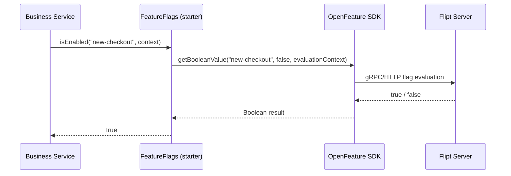
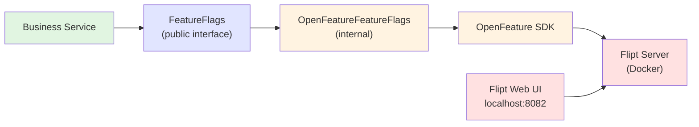
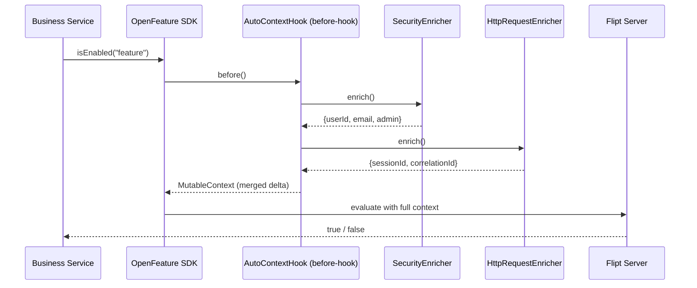

# Feature Flags Starter

A tech starter that provides feature flag evaluation through the [OpenFeature](https://openfeature.dev/) specification, with [Flipt](https://flipt.io/) as the default provider.

## What are Feature Flags?

Feature flags (also called feature toggles) are a technique to enable or disable features at runtime without deploying new code. They decouple deployment from release, allowing teams to ship code continuously while controlling which features are visible to users.

**Use Cases:**
- Gradual rollout of new features to a subset of users
- A/B testing and experimentation
- Kill switches for unstable features in production
- Environment-specific feature availability

## Architecture Overview

This starter abstracts feature flag evaluation behind a simple `FeatureFlags` interface. Business code never interacts with OpenFeature or the underlying provider directly.

### Evaluation Flow



### Component Architecture



1. **Business services** depend only on the `FeatureFlags` interface
2. The **internal implementation** translates calls to OpenFeature SDK
3. **OpenFeature SDK** delegates to the configured provider (Flipt)
4. **Flipt** evaluates the flag and returns the result
5. Non-technical users manage flags through the **Flipt Web UI**

## Key Features

### Evaluation with User Context

Pass user information to enable per-user targeting, percentage rollouts, and A/B tests:

```kotlin
val context = FeatureFlagContext(
    userId = currentUser.id,
    sessionId = session.id,
    email = currentUser.email,
    attributes = mapOf("plan" to "premium"),
)

if (featureFlags.isEnabled("new-checkout", context)) {
    // new checkout flow
}
```

### User & Session Shortcuts

Avoid constructing a full `FeatureFlagContext` when you only need to target by user or session:

```kotlin
if (featureFlags.isEnabledForUser("beta-feature", userId)) {
    // user-targeted rollout
}

if (featureFlags.isDisabledForSession("maintenance-mode", sessionId)) {
    // session-scoped check
}
```

### Automatic Context Injection via Enrichers

Instead of manually passing a `FeatureFlagContext` to every call, register one or more `FeatureFlagContextEnricher` beans. The starter collects them all and injects their combined output before every evaluation via an OpenFeature before-hook. Errors in one enricher never affect the others.



**Example: Spring Security enricher** (in the consuming application, not the starter):

```kotlin
@Bean
fun securityEnricher(): FeatureFlagContextEnricher = FeatureFlagContextEnricher {
    val auth = SecurityContextHolder.getContext().authentication
    val principal = auth?.principal as? InternalUserDetails
    FeatureFlagContext(
        userId = principal?.id,
        email = principal?.username,
        admin = auth?.authorities?.any { it.authority == "ROLE_ADMIN" } == true,
    )
}

@Bean
fun httpRequestEnricher(request: HttpServletRequest): FeatureFlagContextEnricher = FeatureFlagContextEnricher {
    FeatureFlagContext(
        sessionId = request.session?.id,
        correlationId = request.getHeader("X-Correlation-ID"),
    )
}
```

Now `isEnabled("flag")` automatically evaluates with both enrichers' context merged in:

```kotlin
// No manual context construction — Flipt receives userId, email, admin, sessionId, correlationId
if (featureFlags.isEnabled("beta-feature")) { ... }
```

### Health Indicator (Actuator)

When Spring Boot Actuator is on the classpath, the starter exposes the Flipt provider state at `/actuator/health`:

```json
{
  "components": {
    "featureFlags": {
      "status": "UP",
      "details": {
        "provider": "flipt",
        "state": "READY"
      }
    }
  }
}
```

### Provider-Agnostic

The starter uses the OpenFeature specification. Switching from Flipt to another provider (LaunchDarkly, Flagsmith, etc.) only requires changing the internal configuration, not the business code.

## Usage

### 1. Add Dependency

```kotlin
dependencies {
    implementation(project(":feature-flags-starter"))
}
```

### 2. Use from Business Code

With a `FeatureFlagContextProvider` bean, context is injected automatically:

```kotlin
@Service
class CheckoutService(private val featureFlags: FeatureFlags) {

    fun checkout(cart: Cart): CheckoutResult {
        // context (userId, email, admin, sessionId) is auto-injected
        return if (featureFlags.isEnabled("new-checkout-flow")) {
            newCheckoutFlow(cart)
        } else {
            legacyCheckoutFlow(cart)
        }
    }
}
```

You can still pass explicit context when needed (e.g., evaluating for a different user):

```kotlin
featureFlags.isEnabled("feature-x", FeatureFlagContext(userId = otherUserId))
```

### 3. Use in Tests (testFixtures)

`MockFeatureFlags` provides an in-memory store with state inspection and evaluation tracking:

```kotlin
class CheckoutServiceTest {
    private val featureFlags = MockFeatureFlags()
    private val service = CheckoutService(featureFlags)

    @Test
    fun `uses new checkout when flag is enabled`() {
        featureFlags.enableFlag("new-checkout-flow")

        val result = service.checkout("user-1", cart)

        result.flow shouldBe "new"
        featureFlags.wasEvaluated("new-checkout-flow") shouldBe true
    }

    @Test
    fun `falls back to legacy checkout when flag is disabled`() {
        // flags default to disabled — no configuration needed
        val result = service.checkout("user-1", cart)

        result.flow shouldBe "legacy"
    }

    @Test
    fun `inspect mock state`() {
        featureFlags.enableFlag("feature-a")
        featureFlags.disableFlag("feature-b")

        featureFlags.enabledFlags() shouldBe setOf("feature-a")
        featureFlags.disabledFlags() shouldBe setOf("feature-b")

        service.checkout("user-1", cart)

        featureFlags.evaluationCount() shouldBe 1
        featureFlags.lastEvaluation()?.flag shouldBe "new-checkout-flow"
    }
}
```