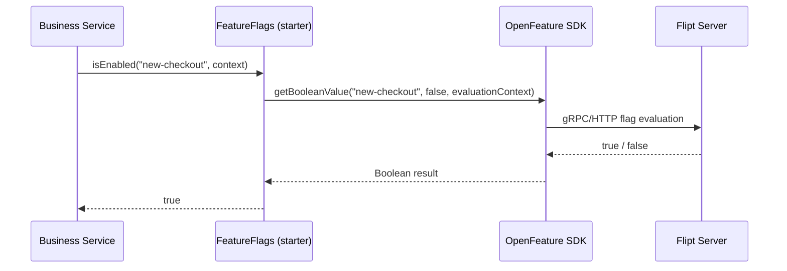
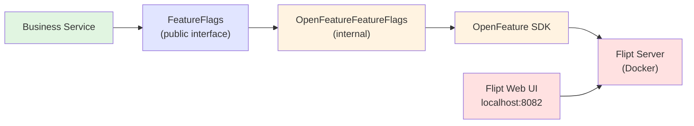

# Feature Flags Starter

A tech starter that provides feature flag evaluation through the [OpenFeature](https://openfeature.dev/) specification, with [Flipt](https://flipt.io/) as the default provider.

## What are Feature Flags?

Feature flags (also called feature toggles) are a technique to enable or disable features at runtime without deploying new code. They decouple deployment from release, allowing teams to ship code continuously while controlling which features are visible to users.

**Use Cases:**
- Gradual rollout of new features to a subset of users
- A/B testing and experimentation
- Kill switches for unstable features in production
- Environment-specific feature availability

## Architecture Overview

This starter abstracts feature flag evaluation behind a simple `FeatureFlags` interface. Business code never interacts with OpenFeature or the underlying provider directly.

### Evaluation Flow


```mermaid
sequenceDiagram
    participant Business as Business Service
    participant API as FeatureFlags (starter)
    participant OF as OpenFeature SDK
    participant Flipt as Flipt Server

    Business->>API: isEnabled("new-checkout", context)
    API->>OF: getBooleanValue("new-checkout", false, evaluationContext)
    OF->>Flipt: gRPC/HTTP flag evaluation
    Flipt-->>OF: true / false
    OF-->>API: Boolean result
    API-->>Business: true
```

### Component Architecture


```mermaid
graph LR
    Consumer["Business Service"]
    API["FeatureFlags<br/>(public interface)"]
    Impl["OpenFeatureFeatureFlags<br/>(internal)"]
    OF["OpenFeature SDK"]
    Flipt["Flipt Server<br/>(Docker)"]
    UI["Flipt Web UI<br/>localhost:8082"]

    Consumer --> API
    API --> Impl
    Impl --> OF
    OF --> Flipt
    UI --> Flipt

    style Consumer fill:#e1f5e1
    style API fill:#e1e5ff
    style Impl fill:#fff3e1
    style OF fill:#fff3e1
    style Flipt fill:#ffe1e1
    style UI fill:#ffe1e1
```

1. **Business services** depend only on the `FeatureFlags` interface
2. The **internal implementation** translates calls to OpenFeature SDK
3. **OpenFeature SDK** delegates to the configured provider (Flipt)
4. **Flipt** evaluates the flag and returns the result
5. Non-technical users manage flags through the **Flipt Web UI**

## Key Features

### Evaluation with User Context

Pass user information to enable per-user targeting, percentage rollouts, and A/B tests:

```kotlin
val context = FeatureFlagContext(
    userId = currentUser.id,
    sessionId = session.id,
    email = currentUser.email,
    attributes = mapOf("plan" to "premium"),
)

if (featureFlags.isEnabled("new-checkout", context)) {
    // new checkout flow
}
```

### Shortcuts

Avoid constructing a full `FeatureFlagContext` when you only need to target a user, or to test the opposite:

```kotlin
if (featureFlags.isEnabledForUser("beta-feature", userId)) {
    // user-targeted rollout
}

if (featureFlags.isDisabled("maintenance-mode")) {
    // flag off
}
```

### Per-Request Context

A servlet filter opens an OpenFeature transaction context for each HTTP request and clears it when the
request ends (`OpenFeatureTransactionContextFilter`). The context stays empty for now: adding the user and
the correlation id to it is still to do. Until then, pass a `FeatureFlagContext` to target a user.

### Health Indicator (Actuator)

When Spring Boot Actuator is on the classpath, the starter exposes the Flipt provider state at `/actuator/health`:

```json
{
  "components": {
    "openFeature": {
      "status": "UP",
      "details": {
        "provider": "flipt",
        "state": "READY"
      }
    }
  }
}
```

### Provider-Agnostic

The starter uses the OpenFeature specification. Switching from Flipt to another provider (LaunchDarkly, Flagsmith, etc.) only requires changing the internal configuration, not the business code.

## Usage

### 1. Add Dependency

```kotlin
dependencies {
    implementation(project(":feature-flags-starter"))
}
```

### 2. Use from Business Code

Inject the `FeatureFlags` interface:

```kotlin
@Service
class CheckoutService(private val featureFlags: FeatureFlags) {

    fun checkout(cart: Cart): CheckoutResult {
        return if (featureFlags.isEnabled("new-checkout-flow")) {
            newCheckoutFlow(cart)
        } else {
            legacyCheckoutFlow(cart)
        }
    }
}
```

Pass an explicit context to target a user:

```kotlin
featureFlags.isEnabled("feature-x", FeatureFlagContext(userId = otherUserId))
```

### 3. Use in Tests (testFixtures)

`MockFeatureFlags` provides an in-memory store with state inspection and evaluation tracking:

```kotlin
class CheckoutServiceTest {
    private val featureFlags = MockFeatureFlags()
    private val service = CheckoutService(featureFlags)

    @Test
    fun `uses new checkout when flag is enabled`() {
        featureFlags.configure("new-checkout-flow", enabled = true)

        val result = service.checkout(cart)

        result.flow shouldBe "new"
        featureFlags.wasEvaluated("new-checkout-flow") shouldBe true
    }

    @Test
    fun `falls back to legacy checkout when flag is disabled`() {
        // flags default to disabled — no configuration needed
        val result = service.checkout(cart)

        result.flow shouldBe "legacy"
    }

    @Test
    fun `inspect mock state`() {
        featureFlags.configure("feature-a", enabled = true)
        featureFlags.configure("feature-b", enabled = false)

        featureFlags.enabledFlags() shouldBe setOf("feature-a")
        featureFlags.disabledFlags() shouldBe setOf("feature-b")

        service.checkout(cart)

        featureFlags.evaluationCount() shouldBe 1
        featureFlags.lastEvaluation()?.flag shouldBe "new-checkout-flow"
    }
}
```