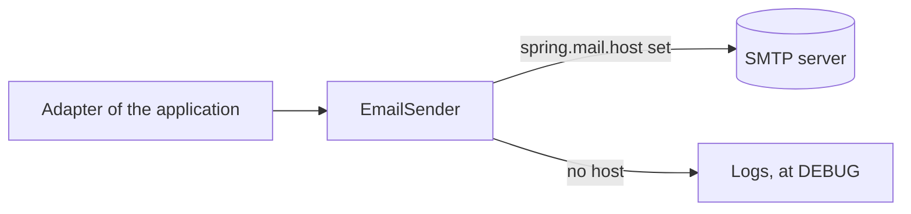

# Mail Starter

A [tech starter](https://github.com/mboisnard/drinkit/blob/master/docs/src/engineering/architecture/tech-starters.md)
that sends the application's emails, such as a sign-in code. An adapter injects
`EmailSender`, and the starter delivers each email to an SMTP server or, when none is set, writes it to the logs.


```mermaid
flowchart LR
    Adapter[Adapter of the application] --> EmailSender
    EmailSender -->|spring.mail.host set| Smtp[(SMTP server)]
    EmailSender -->|no host| Logs["Logs, at DEBUG"]
```

## Usage

A module declares the starter in its build file:

```kotlin
dependencies {
    implementation(project(":mail-starter"))
}
```

```kotlin
emailSender.send(
    Email(
        sender = Sender("contact@drinkit.com"),
        recipients = Recipients(setOf(Recipient("jane.doe@example.com"))),
        subject = Subject("Your DrinkIt sign-in code"),
        content = Content(TXT, "Your code is 731904"),
    ),
)
```

- **With `spring.mail.host` set**, the email goes to that SMTP server.
- **Without a host**, the starter warns at startup and logs each email at `DEBUG`.

## Configuration

| Property | Default | Environment variable |
|---|---|---|
| `spring.mail.host` | None, required in production: without it, emails go to the logs | `SPRING_MAIL_HOST` |
| `spring.mail.username` | None, required in production | `SPRING_MAIL_USERNAME` |
| `spring.mail.password` | None, required in production | `SPRING_MAIL_PASSWORD` |
| `spring.mail.port` | `587`, with STARTTLS and 5 second timeouts | `SPRING_MAIL_PORT` |
| `starters.mail.enabled` | `true`, `false` registers no `EmailSender` | `STARTERS_MAIL_ENABLED` |

## Tests

From `testFixtures(project(":mail-starter"))`, `SpyEmailSender` records the emails an adapter sends, and
`@MailpitIntegrationTest` starts [Mailpit](https://mailpit.axllent.org/), an SMTP server in Docker, for a real send.

## Limits

- A failed send is dropped and logged at `ERROR` with the subject. Nothing retries it.
- Without a host, the emails are logged at `DEBUG`, a level production does not show.
