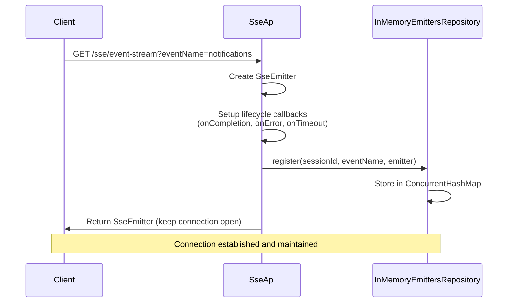
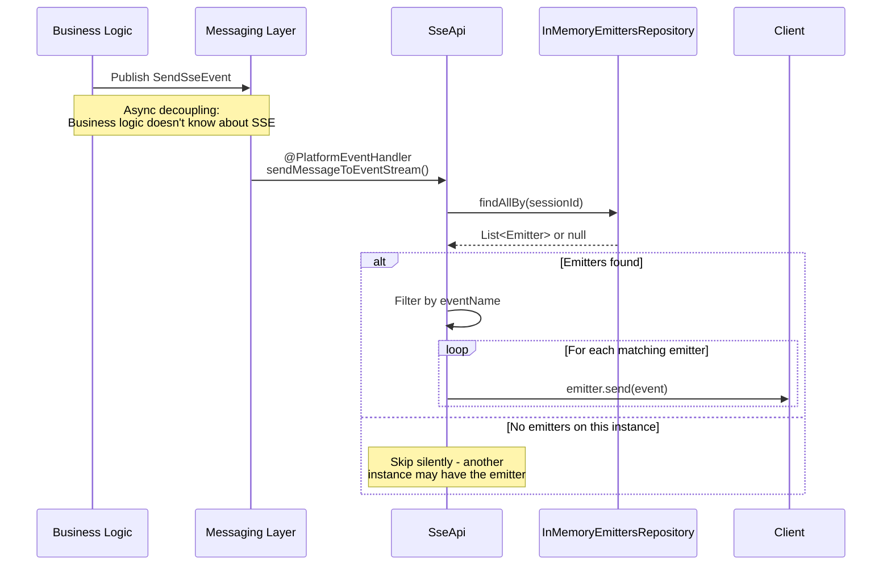
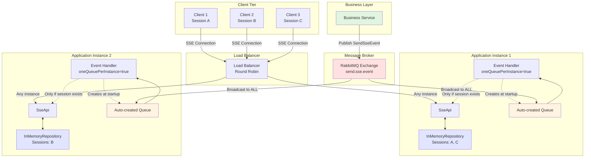

# SSE Starter

A Spring Boot starter that provides a scalable, production-ready implementation of Server-Sent Events (SSE) with multi-instance support.

## What is Server-Sent Events (SSE)?

Server-Sent Events (SSE) is a server push technology that enables servers to push real-time updates to clients over a single HTTP connection. Unlike WebSockets, SSE is:

- **Unidirectional**: Server-to-client communication only
- **HTTP-based**: Works over standard HTTP/HTTPS
- **Automatic reconnection**: Built-in browser support for reconnection
- **Text-based**: Simple protocol for sending text data

**Use Cases:**
- Real-time notifications
- Live updates (stock prices)
- Activity feeds
- Progress tracking

## Architecture Overview

This starter implements a scalable SSE solution that separates business logic from technical concerns and supports horizontal scaling across multiple application instances.

### Client Connection Flow



### Sending Message Flow



### Multi-Instance Architecture



**How it works:**

1. **Dynamic Routing**: Clients connect through a load balancer to any available instance
2. **Instance-Local Storage**: Each instance maintains its own in-memory repository of connected emitters for sessions it handles
3. **Auto-Queue Creation**: Each instance creates its own RabbitMQ queue at startup (via `oneQueuePerInstance=true`)
4. **Business Event**: A business service publishes a `SendSseEvent` to the exchange, unaware of which instance holds the connection
5. **Broadcast to All**: The exchange broadcasts the event to ALL instance queues simultaneously
6. **Smart Filtering**: Every instance receives the event, but only the one with the matching session's emitter processes it (others skip silently)
7. **No Coordination Needed**: Instances operate independently; the right instance automatically handles its sessions

## Key Features

### ✅ Separation of Concerns

Business services **don't need to know about SSE**. They simply publish a `SendSseEvent`:

```kotlin
// In your business service
eventPublisher.publish(
    SendSseEvent(
        eventName = "order-update",
        sessionId = userSessionId,
        payload = orderStatus
    )
)
```

The SSE infrastructure handles the technical details of delivering the message.

### ✅ Multi-Instance Scalability

- **Async Messaging**: Uses `SendSseEvent` platform event
- **RabbitMQ Broadcasting**: Messages are sent to ALL instances via exchange
- **Instance-Aware**: Only the instance holding the emitter sends the message
- **No Coordination**: Instances operate independently without shared state

### ✅ Memory Leak Prevention

Automatic cleanup of dead connections through lifecycle callbacks:

- **onCompletion**: Client gracefully disconnects
- **onError**: Network error or send failure
- **onTimeout**: Emitter timeout (default: 3 minutes)

Thread-safe collections (`ConcurrentHashMap`, `CopyOnWriteArrayList`) ensure safe concurrent access.

### ✅ Multiple Event Streams per Session

A single session can subscribe to multiple event types:

```javascript
// Client can have multiple streams
const notifications = new EventSource('/sse/event-stream?eventName=notifications');
const updates = new EventSource('/sse/event-stream?eventName=order-updates');
```

Each is managed independently and filtered by `eventName`.

## Usage

### 1. Add Dependency

```kotlin
dependencies {
    implementation(project(":sse-starter"))
}
```

### 2. Client Connection (JavaScript)

```javascript
const eventSource = new EventSource('/sse/event-stream?eventName=notifications');

eventSource.addEventListener('notifications', (event) => {
    const data = JSON.parse(event.data);
    console.log('Received:', data);
});

eventSource.onerror = (error) => {
    console.error('SSE Error:', error);
};
```

### 3. Send Events from Business Logic

```kotlin
@Service
class NotificationService(
    private val eventPublisher: EventPublisher
) {
    fun notifyUser(sessionId: String, message: String) {
        eventPublisher.publish(
            SendSseEvent(
                eventName = "notifications",
                sessionId = sessionId,
                payload = mapOf("message" to message, "timestamp" to Instant.now())
            )
        )
    }
}
```