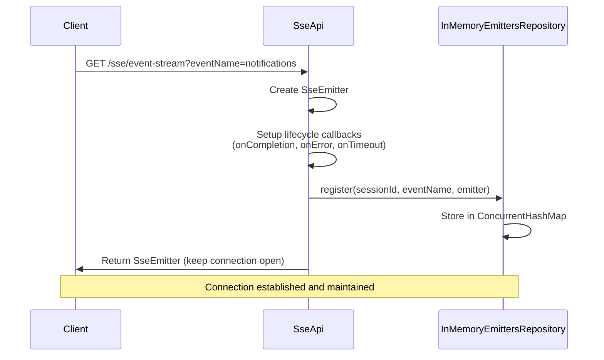
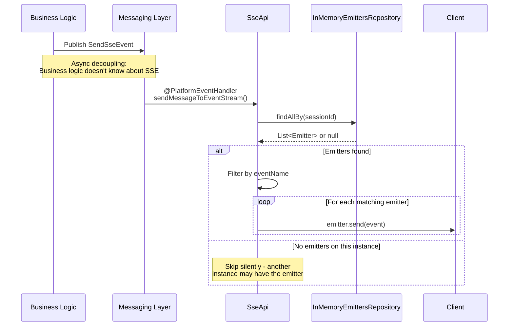

# SSE Starter

A Spring Boot starter that implements Server-Sent Events (SSE): clients subscribe to named event streams, and business code pushes to them through platform events.

## What is Server-Sent Events (SSE)?

Server-Sent Events (SSE) is a server push technology that enables servers to push real-time updates to clients over a single HTTP connection. Unlike WebSockets, SSE is:

- **Unidirectional**: Server-to-client communication only
- **HTTP-based**: Works over standard HTTP/HTTPS
- **Automatic reconnection**: Built-in browser support for reconnection
- **Text-based**: Simple protocol for sending text data

**Use Cases:**
- Real-time notifications
- Live updates (stock prices)
- Activity feeds
- Progress tracking

## Architecture Overview

This starter separates business logic from technical concerns. It is designed for several application instances, but delivering an event across instances needs a message broker the project does not have yet, see [Multiple Instances](#multiple-instances).

### Client Connection Flow


```mermaid
sequenceDiagram
    participant Client
    participant SseApi
    participant Repository as InMemoryEmittersRepository

    Client->>SseApi: GET /sse/event-stream?eventName=notifications
    SseApi->>SseApi: Create SseEmitter
    SseApi->>SseApi: Setup lifecycle callbacks<br/>(onCompletion, onError, onTimeout)
    SseApi->>Repository: register(sessionId, eventName, emitter)
    Repository->>Repository: Store in ConcurrentHashMap
    SseApi->>Client: Return SseEmitter (keep connection open)

    Note over Client,Repository: Connection established and maintained
```

### Sending Message Flow


```mermaid
sequenceDiagram
    participant Business as Business Logic
    participant Messaging as Messaging Layer
    participant SseApi
    participant Repository as InMemoryEmittersRepository
    participant Client

    Business->>Messaging: Publish SendSseEvent
    Note over Business,Messaging: Async decoupling:<br/>Business logic doesn't know about SSE
    Messaging->>SseApi: @PlatformEventHandler<br/>sendMessageToEventStream()
    SseApi->>Repository: findAllBy(sessionId)
    Repository-->>SseApi: List<Emitter> or null

    alt Emitters found
        SseApi->>SseApi: Filter by eventName
        loop For each matching emitter
            SseApi->>Client: emitter.send(event)
        end
    else No emitters on this instance

        Note over SseApi: Skip silently - another<br/>instance may have the emitter
    end
```

### Multiple Instances

The handler is declared with `oneQueuePerInstance = true`, so that a broker-backed `messaging-starter` can
deliver each event to every instance, where only the one holding the session's emitter sends it. Today
`messaging-starter` publishes Spring application events within the same process: an event only reaches the
emitters of the instance that published it.

## Key Features

### ✅ Separation of Concerns

Business services **don't need to know about SSE**. They simply publish a `SendSseEvent`:

```kotlin
// In your business service
eventPublisher.publish(
    SendSseEvent(
        eventName = "order-update",
        sessionId = userSessionId,
        payload = orderStatus
    )
)
```

The SSE infrastructure handles the technical details of delivering the message.

### ✅ Instance-Aware Delivery

- **Async Messaging**: Uses the `SendSseEvent` platform event
- **Instance-Aware**: An instance without the session's emitter skips the event silently
- **Single Instance for Now**: Broadcasting to every instance waits for a broker-backed messaging implementation

### ✅ Memory Leak Prevention

Automatic cleanup of dead connections through lifecycle callbacks:

- **onCompletion**: Client gracefully disconnects
- **onError**: Network error or send failure
- **onTimeout**: Emitter timeout (default: 3 minutes)

Thread-safe collections (`ConcurrentHashMap`, `CopyOnWriteArrayList`) ensure safe concurrent access.

### ✅ Multiple Event Streams per Session

A single session can subscribe to multiple event types:

```javascript
// Client can have multiple streams
const notifications = new EventSource('/sse/event-stream?eventName=notifications');
const updates = new EventSource('/sse/event-stream?eventName=order-updates');
```

Each is managed independently and filtered by `eventName`.

## Usage

### 1. Add Dependency

```kotlin
dependencies {
    implementation(project(":sse-starter"))
}
```

### 2. Client Connection (JavaScript)

```javascript
const eventSource = new EventSource('/sse/event-stream?eventName=notifications');

eventSource.addEventListener('notifications', (event) => {
    const data = JSON.parse(event.data);
    console.log('Received:', data);
});

eventSource.onerror = (error) => {
    console.error('SSE Error:', error);
};
```

### 3. Send Events from Business Logic

```kotlin
@Service
class NotificationService(
    private val eventPublisher: PlatformEventPublisher
) {
    fun notifyUser(sessionId: String, message: String) {
        eventPublisher.publish(
            SendSseEvent(
                eventName = "notifications",
                sessionId = sessionId,
                payload = mapOf("message" to message, "timestamp" to Instant.now())
            )
        )
    }
}
```